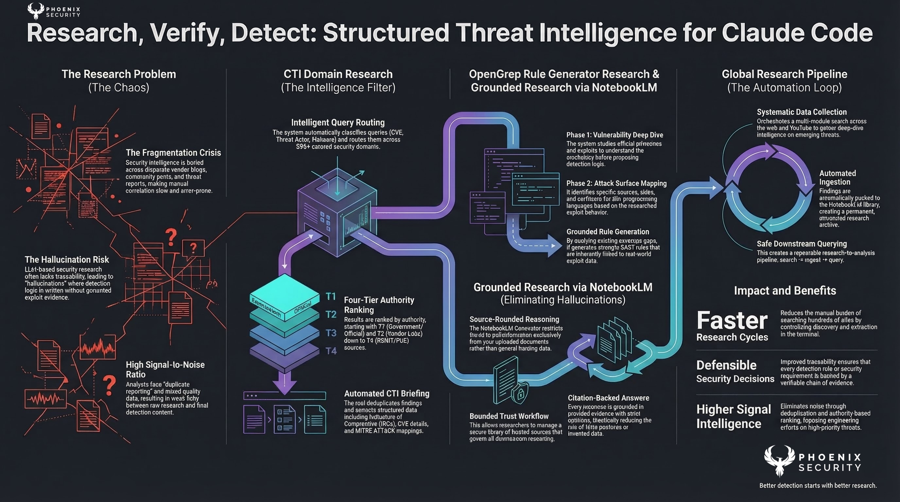
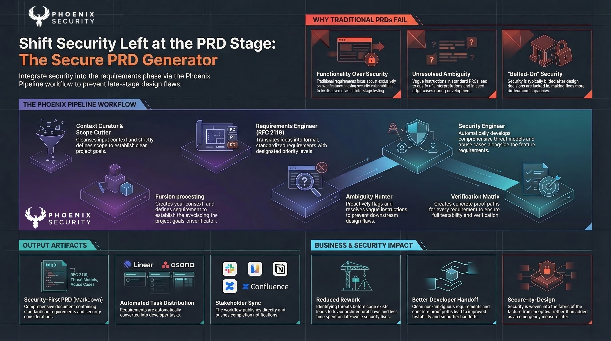
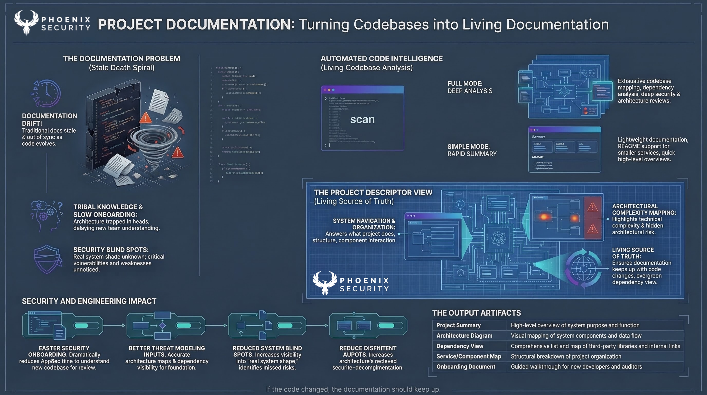

# Security Skills for Claude Code

**Open-source security automation toolkit for Claude Code** — built by the engineering and security teams at [Phoenix Security](https://phoenix.security) for the global security community.

[](LICENSE)
[](https://claude.ai)
[](CONTRIBUTING.md)

> Threat intelligence research, SAST rule generation, secure product requirements, vulnerability analysis, NotebookLM integration, and security automation — all from your Claude Code terminal.

---

## Table of Contents

- [What Is This Repository?](#what-is-this-repository)
- [What's Included](#whats-included)
  - [Skills](#skills)
  - [Plugins](#plugins)
  - [Feature Descriptor — Phoenix Pipeline](#feature-descriptor--phoenix-pipeline)
- [Quick Start](#quick-start)
- [Repository Structure](#repository-structure)
- [Skills Reference](#skills-reference)
  - [CTI Domain Research](#1-cti-domain-research)
  - [Secure PRD Generator](#2-secure-prd-generator)
  - [OpenGrep Rule Generator](#3-opengrep-rule-generator)
  - [OpenGrep Rule Generator Research](#4-opengrep-rule-generator-research)
  - [NotebookLM Connector](#5-notebooklm-connector)
  - [Global Research Pipeline](#6-global-research-pipeline)
  - [Project Documentation](#7-project-documentation)
- [Plugins Reference](#plugins-reference)
  - [CTI Search Plugin](#1-cti-search-plugin)
  - [Secure PRD Plugin](#2-secure-prd-plugin)
- [Phoenix Pipeline — Feature Descriptor](#phoenix-pipeline--feature-descriptor)
- [Domain Tiers](#domain-tiers)
- [NotebookLM Integration](#notebooklm-integration)
- [Configuration](#configuration)
- [Contributing](#contributing)
- [Frequently Asked Questions (FAQ)](#frequently-asked-questions-faq)
- [License](#license)
- [Support](#support)
- [Acknowledgments](#acknowledgments)

---

## Overview







---

## What Is This Repository?

This repository is a **curated collection of skills, plugins, and automation pipelines** designed for [Claude Code](https://claude.ai) — Anthropic's CLI for AI-assisted software engineering.

It was built by the **engineering and security engineering teams at [Phoenix Security](https://phoenix.security)** and released as open source so that security professionals, DevSecOps engineers, AppSec teams, and developers worldwide can benefit from and contribute to better security tooling.

**Who is this for?**

- Security engineers and analysts performing threat intelligence research
- DevSecOps teams building secure-by-design products
- AppSec professionals writing security-focused requirements and SAST rules
- Penetration testers and red teamers gathering OSINT
- Vulnerability researchers creating detection rules from CVE/CWE analysis
- Developers who want security built into their workflow
- Anyone using Claude Code who wants structured security automation

---

## What's Included

### Skills

Skills are instruction-based workflows that guide Claude Code's behavior. They don't execute code directly but define how Claude should approach specific tasks.

| Skill | Description | Folder |
|-------|-------------|--------|
| **[CTI Domain Research](skills/cti-search-skill/)** | Search 300+ curated security domains for threat intelligence, CVEs, malware, and breach reports | `skills/cti-search-skill/` |
| **[Secure PRD Generator](skills/secure-prd-skill/)** | Generate security-focused Product Requirements Documents with threat modeling | `skills/secure-prd-skill/` |
| **[OpenGrep Rule Generator](skills/opengrep-rule-generator/)** | Create opengrep/semgrep SAST rules for vulnerability detection across 30+ languages | `skills/opengrep-rule-generator/` |
| **[OpenGrep Rule Generator Research](skills/opengrep-rule-generator-research/)** | Research CVEs/CWEs with web search, then generate detection rules from findings | `skills/opengrep-rule-generator-research/` |
| **[NotebookLM Connector](skills/notebooklm/)** | Query Google NotebookLM notebooks from Claude Code for citation-backed, source-grounded answers | `skills/notebooklm/` |
| **[Global Research Pipeline](skills/global-research-notebook-lm/)** | Systematic web and YouTube research with NotebookLM ingestion | `skills/global-research-notebook-lm/` |
| **[Project Documentation](skills/project%20Documentaion%20skill/)** | Auto-generate comprehensive project documentation | `skills/project%20Documentaion%20skill/` |

### Plugins

Plugins provide executable functionality via MCP (Model Context Protocol) servers and CLI tools.

| Plugin | Description | Folder |
|--------|-------------|--------|
| **[CTI Search Plugin](plugins/cti-search-plugin/)** | MCP server + CLI for executing CTI searches across 595+ domains with NotebookLM integration | `plugins/cti-search-plugin/` |
| **[Secure PRD Plugin](plugins/secure-prd/)** | PRD generator with Confluence, Linear, Asana, Slack, Notion, and Gmail integrations | `plugins/secure-prd/` |

### Feature Descriptor — Phoenix Pipeline

The **Phoenix Pipeline** is a 12-role specification system for producing rigorous, security-aware product requirements. Each role is a dedicated skill file.

| Role | Skill File | Purpose |
|------|-----------|---------|
| Pipeline Navigator | `pipeline-navigator.skill` | Orchestrates the full pipeline |
| Context Curator | `context-curator.skill` | Extracts and cleanses input context |
| Scope Cutter | `scope-cutter.skill` | Defines in/out scope and goals |
| Constraint Distiller | `constraint-distiller.skill` | Identifies constraints and acceptance criteria |
| Requirements Engineer | `requirements-engineer.skill` | Creates RFC 2119 requirements with IDs |
| Ambiguity Hunter | `ambiguity-hunter.skill` | Flags and resolves ambiguities |
| Security Engineer | `security-engineer.skill` | Develops threat models and abuse cases |
| Contract Architect | `contract-architect.skill` | Designs APIs, events, and error taxonomy |
| Verification Matrix | `verification-matrix.skill` | Creates proof paths for every requirement |
| Batch Planner | `batch-planner.skill` | Plans incremental, verifiable delivery |
| Final Gate | `final-gate.skill` | Go/no-go decision with blocker list |
| Orchestrator | `orchestrator.skill` | Coordinates all roles and manages flow |

> All feature-descriptor skills live in the [`feature-descriptor/`](feature-descriptor/) folder.

---

## Quick Start

### Prerequisites

- [Claude Code](https://claude.ai) installed
- Node.js 18+ (for plugins)
- A search API key — [Brave Search](https://api.search.brave.com/app/keys) (recommended, 2,000 free requests/month) or [SerpAPI](https://serpapi.com) (100 free/month)

### Installation

Choose the method that works best for you.

#### Method 1: Claude Marketplace (Recommended)

See the **[Marketplace Installation Guide](MARKETPLACE_INSTALL.md)** for detailed steps with troubleshooting.

```
1. Open Claude Code
2. Navigate to Skills Marketplace
3. Search "CTI Domain Research" or "Security Skills"
4. Click Install
5. Configure API keys (see Configuration below)
```

#### Method 2: Git Clone

```bash
# Clone the repository
git clone https://github.com/Security-Phoenix-demo/security-skills-claude-code.git
cd security-skills-claude-code

# Install CTI Search Skill
cd skills/cti-search-skill && bash install.sh

# Install CTI Search Plugin
cd ../../plugins/cti-search-plugin && bash install.sh
```

#### Method 3: Direct Copy

```bash
# Copy skills
cp -r skills/cti-search-skill ~/.claude/skills/
cp -r skills/secure-prd-skill ~/.claude/skills/

# Copy and install plugin
cp -r plugins/cti-search-plugin ~/.claude/plugins/
cd ~/.claude/plugins/cti-search-plugin && npm install
cp .env.example .env   # Then edit .env with your API keys
```

---

## Repository Structure

```
security-skills-claude-code/
│
├── README.md                              # This file — start here
├── CONTRIBUTING.md                        # How to contribute skills and plugins
├── MARKETPLACE_INSTALL.md                 # Detailed marketplace installation guide
├── LICENSE                                # MIT License
│
├── skills/                                # Instruction-based skills
│   ├── cti-search-skill/                  # CTI domain research across 300+ sources
│   ├── cti-search-skill/                  # (contains cti-domain-research.skill)
│   ├── secure-prd-skill/                  # Security-focused PRD generation
│   ├── opengrep-rule-generator/           # SAST rule generation (30+ languages)
│   ├── opengrep-rule-generator-research/  # CVE/CWE research + rule generation
│   ├── notebooklm/                        # NotebookLM notebook querying
│   ├── global-research-notebook-lm/       # Research pipeline with NotebookLM
│   ├── research-pipeline.skill            # Research automation skill
│   └── project Documentaion skill/        # Auto project documentation
│
├── plugins/                               # Executable tools (MCP + CLI)
│   ├── cti-search-plugin/                 # CTI search engine
│   │   ├── index.js                       # CLI entry point
│   │   ├── mcp-server.js                  # MCP tool server
│   │   ├── package.json                   # Dependencies
│   │   ├── .env.example                   # Environment template
│   │   ├── install.sh                     # Installer
│   │   └── data/
│   │       ├── domains.txt                # 595 curated security domains
│   │       └── tier-map.json              # Domain tier + authority scores
│   │
│   └── secure-prd/                        # PRD generator plugin
│       ├── prd-generator.skill            # Skill definition
│       └── prd-generator-plugin.jsx       # UI component
│
└── feature-descriptor/                    # Phoenix Pipeline (12 specialized roles)
    ├── pipeline-navigator.skill
    ├── context-curator.skill
    ├── scope-cutter.skill
    ├── constraint-distiller.skill
    ├── requirements-engineer.skill
    ├── ambiguity-hunter.skill
    ├── security-engineer.skill
    ├── contract-architect.skill
    ├── verification-matrix.skill
    ├── batch-planner.skill
    ├── final-gate.skill
    └── orchestrator.skill
```

---

## Skills Reference

### 1. CTI Domain Research

**Folder:** [`skills/cti-search-skill/`](skills/cti-search-skill/)

Search 300+ curated security domains for threat intelligence. The skill routes queries intelligently across four domain tiers based on query type.

**Example prompts:**
```
Search for threat intelligence on CVE-2024-21762
Find recent LockBit ransomware reports
What are security vendors saying about ALPHV?
Research MITRE T1190 exploitation techniques
Collect CTI on supply chain attacks in npm
```

**What it does:**
1. Classifies your query (CVE, threat actor, malware, general)
2. Routes to appropriate domain tiers
3. Searches across 300+ curated security sources
4. Deduplicates and ranks results by authority
5. Extracts IOCs, CVEs, and MITRE ATT&CK mappings
6. Returns a structured CTI brief

---

### 2. Secure PRD Generator

**Folder:** [`skills/secure-prd-skill/`](skills/secure-prd-skill/)

Generate full Product Requirements Documents with built-in security considerations. Uses a 10-role specification pipeline (the Phoenix Pipeline) to produce rigorous, RFC 2119-compliant requirements with threat models.

**Outputs:**
- Full PRD markdown document
- Cursor-compatible plan file (`.cursor/plans/`)
- Confluence page (via Atlassian MCP)
- RFC 2119 requirements with P0/P1/P2 priorities
- Security threat model and abuse cases
- Optional: Linear/Asana tasks, Slack notifications, Notion pages, Gmail drafts

---

### 3. OpenGrep Rule Generator

**Folder:** [`skills/opengrep-rule-generator/`](skills/opengrep-rule-generator/)

Generate valid opengrep/semgrep SAST (Static Application Security Testing) rules for vulnerability detection. Supports **30+ programming languages** including Python, JavaScript, TypeScript, Java, Go, Ruby, PHP, C#, Rust, Terraform/HCL, and Solidity.

**Two workflows:**
- **Guided Discovery** — interactive Q&A to discover what patterns to detect
- **Vulnerability-Driven** — given CVEs, CWEs, or OWASP categories, generates rules automatically

**Capabilities:**
- Two rule modes: **Search** (structural pattern matching) and **Taint** (data flow analysis with sources, sinks, sanitizers)
- False positive reduction with `pattern-not`, `pattern-not-inside`, `metavariable-regex`
- Test file generation (true positives and true negatives)
- Batch generation for OWASP Top 10 coverage
- CWE/OWASP metadata tagging on every rule

**Example prompts:**
```
Create an opengrep rule to detect SQL injection in Python Flask apps
Generate a taint analysis rule for XSS in React components
Write semgrep rules for OWASP Top 10 in Java Spring Boot
Detect hardcoded AWS credentials in any language
```

**Key files:**
- `SKILL.md` — full skill specification and workflow
- `RULES_SYNTAX.md` — comprehensive opengrep/semgrep syntax reference
- `OPENGREP_RULE_GENERATOR_PROMPT.md` — system prompt for rule generation

---

### 4. OpenGrep Rule Generator Research

**Folder:** [`skills/opengrep-rule-generator-research/`](skills/opengrep-rule-generator-research/)

Extended version of the OpenGrep Rule Generator with a **vulnerability research phase**. Uses web search and web fetch to research CVEs and CWEs before generating detection rules — producing better, more targeted rules grounded in real vulnerability data.

**Research pipeline (4 phases):**
1. **Understand the vulnerability** — search CVE/CWE databases, fetch official advisories, study exploit examples
2. **Map language-specific attack surface** — identify sources, sinks, sanitizers, and propagators for the target language
3. **Study existing detection** — search for existing semgrep/opengrep rules and identify coverage gaps
4. **Document findings** — write a research summary at the top of each generated rule file

**Example prompts:**
```
Research CVE-2024-21762 and create detection rules for it
Generate opengrep rules for CWE-89 (SQL Injection) in Python with research
Investigate Log4Shell and build comprehensive detection coverage
Research SSRF vulnerabilities in Node.js and create taint analysis rules
```

**When to use this vs. the standard OpenGrep Rule Generator:**
- Use **OpenGrep Rule Generator** when you already know the pattern you want to detect
- Use **OpenGrep Rule Generator Research** when you need to research a vulnerability first, then generate rules from your findings

---

### 5. NotebookLM Connector

**Folder:** [`skills/notebooklm/`](skills/notebooklm/)

Query [Google NotebookLM](https://notebooklm.google.com/) notebooks directly from Claude Code. Get source-grounded, citation-backed answers from Gemini with drastically reduced hallucination — responses are based only on your uploaded documents.

**Capabilities:**
- Query any NotebookLM notebook by ID or URL
- Manage a notebook library (add, remove, list, search, activate/deactivate)
- Browser automation with persistent authentication
- Follow-up queries within the same notebook context
- Coverage analysis to ensure all parts of your question are answered

**Example prompts:**
```
Query my security-docs notebook about authentication best practices
Add this NotebookLM URL to my library: https://notebooklm.google.com/notebook/abc123
List my notebooks
What does my threat-model notebook say about SSRF risks?
```

**Setup requirements:**
- Chrome or Edge browser running with the "Claude in Chrome" extension
- Google account logged in to NotebookLM
- One-time authentication setup (see `AUTHENTICATION.md`)

**Key files:**
- `SKILL.md` — skill specification and query workflow
- `README.md` — extended documentation with setup guide
- `AUTHENTICATION.md` — step-by-step authentication setup
- `scripts/` — Python automation scripts for browser interaction
- `references/` — API reference, troubleshooting, usage patterns

---

### 6. Global Research Pipeline

**Folder:** [`skills/global-research-notebook-lm/`](skills/global-research-notebook-lm/)

A systematic research pipeline that combines web search and YouTube research, then pushes findings into Google NotebookLM for citation-backed analysis.

**Components:**
- Web research module
- YouTube research module
- NotebookLM push automation
- Full pipeline orchestration

---

### 7. Project Documentation

**Folder:** [`skills/project Documentaion skill/`](skills/project%20Documentaion%20skill/)

Automatically generate comprehensive project documentation from your codebase. Available in two variants:

- **Full mode** — deep analysis with architecture diagrams and dependency mapping
- **Simple mode** — lightweight summary for quick documentation needs

Includes its own `HOW_IT_WORKS.md`, `INSTALL.md`, `MODES_REFERENCE.md`, and `TROUBLESHOOTING.md`.

---

## Plugins Reference

### 1. CTI Search Plugin

**Folder:** [`plugins/cti-search-plugin/`](plugins/cti-search-plugin/)

The execution engine behind CTI searches. Available as a **CLI tool**, **MCP server**, or **slash command**.

#### Usage Modes

**Slash command:**
```
/cti-search CVE-2024-21762
/cti-search LockBit ransomware --full --since 30
/cti-search ALPHV --notebooklm --tier 2
```

**CLI:**
```bash
node index.js --query "CVE-2024-21762" --full
node index.js --query "LockBit" --tier 2 --since 30 --notebooklm
node index.js --query "supply chain attack npm" --json
```

**MCP tool (conversational):**
```
Use the CTI search tool to find recent ransomware reports
```

#### Flags

| Flag | Description | Default |
|------|-------------|---------|
| `--query <q>` | Search subject (required) | — |
| `--count <n>` | Results per tier | 10 |
| `--tier <1-4>` | Restrict to specific tier | All |
| `--since <days>` | Recency filter | 90 |
| `--full` | Long-form brief with MITRE mapping | Brief |
| `--json` | Raw JSON output | Formatted |
| `--notebooklm` | Push sources to NotebookLM | Disabled |
| `--notebook-id <id>` | Override NotebookLM notebook | From env |

---

### 2. Secure PRD Plugin

**Folder:** [`plugins/secure-prd/`](plugins/secure-prd/)

Generates security-focused Product Requirements Documents and integrates with external project management tools:

- **Atlassian Confluence** — publishes PRD as a page
- **Linear / Asana** — creates tasks from requirements
- **Slack** — sends notifications on PRD completion
- **Notion** — mirrors the PRD
- **Gmail** — drafts stakeholder emails

---

## Phoenix Pipeline — Feature Descriptor

**Folder:** [`feature-descriptor/`](feature-descriptor/)

The Phoenix Pipeline is a **12-role specification system** that breaks down feature requirements into discrete, expert-reviewed stages. Each role is a standalone `.skill` file that can be used independently or orchestrated together.

### How It Works

```
Input (feature request / brief)
  │
  ├─→ Context Curator         — extract and cleanse context
  ├─→ Scope Cutter            — define in/out scope
  ├─→ Constraint Distiller    — identify constraints + acceptance criteria
  ├─→ Requirements Engineer   — RFC 2119 requirements with IDs
  ├─→ Ambiguity Hunter        — flag and resolve ambiguities
  ├─→ Security Engineer       — threat models + abuse cases
  ├─→ Contract Architect      — API design, events, errors
  ├─→ Verification Matrix     — proof paths for every requirement
  ├─→ Batch Planner           — incremental delivery plan
  ├─→ Final Gate              — go/no-go with blocker list
  │
  └─→ Output: production-ready PRD with security built in
```

The **Pipeline Navigator** orchestrates the flow, and the **Orchestrator** coordinates handoffs between roles.

---

## Domain Tiers

The CTI search uses a four-tier domain system for intelligent query routing:

| Tier | Category | Use Case | Example Sources |
|------|----------|----------|-----------------|
| **T1** | Authoritative / Government | CVEs, advisories, official alerts | CISA, NVD, MSRC, NCSC, Red Hat |
| **T2** | Vendor Research | Deep technical analysis | Unit42, Talos, Securelist, DFIR Report, Mandiant |
| **T3** | News / Community | Situational awareness | BleepingComputer, Krebs on Security, The Record, Hacker News |
| **T4** | OSINT / PoC | Malware samples, exploits, indicators | any.run, VulnCheck, AttackerKB, GreyNoise |

### Routing Logic

| Query Type | Primary Tier | Secondary Tier |
|------------|-------------|----------------|
| CVE lookups | T1 (authoritative) | T2 (vendor analysis) |
| Threat actors / malware | T2 (research) | T4 (OSINT) |
| News / situational | T3 (news) | T2 (context) |
| PoC / exploits | T4 (technical) | T2 (details) |
| General queries | All tiers | Ranked by authority |

---

## NotebookLM Integration

Push CTI research findings directly into [Google NotebookLM](https://notebooklm.google.com/) for citation-backed analysis powered by Gemini.

### Setup

1. Install the [notebooklm-connector plugin](https://github.com/Security-Phoenix-demo/security-skills-claude-code/tree/main/skills/notebooklm)
2. Get your notebook ID from the URL: `https://notebooklm.google.com/notebook/<YOUR-ID>`
3. Set environment variable: `export NOTEBOOKLM_NOTEBOOK_ID=your_id`

### Usage

```bash
/cti-search CVE-2024-21762 --notebooklm
```

The plugin searches, collects result URLs, pushes them as sources to your notebook, and reports the count.

---

## Configuration & Customization

All skills and plugins are designed to be customized for your organization. No internal identifiers, names, or workspace details are hardcoded — you provide your own on first use.

### Skill Customization

#### CTI Search — Customization

| Setting | How to Set | Notes |
|---------|-----------|-------|
| Search API key | `.env` file or environment variable | Brave Search recommended (free tier) |
| NotebookLM notebook ID | `.env` or `--notebook-id` flag | Optional — for research ingestion |
| Custom domains | Edit `data/domains.txt` + `data/tier-map.json` | Add your own security sources |
| Default result count | `--count N` flag | Per-query override |

#### Secure PRD — Customization

On first use, Claude will prompt you for:

| Setting | How to Set | Notes |
|---------|-----------|-------|
| Owner name(s) | Prompt, env var `PRD_OWNER`, or in-message | Shown on all PRD outputs |
| Stakeholders | Prompt, env var `PRD_STAKEHOLDERS`, or in-message | Interested parties list |
| Confluence space key | Prompt, env var `PRD_CONFLUENCE_SPACE`, or in-message | Where PRD pages are created |
| Confluence template | Prompt, env var `PRD_CONFLUENCE_TEMPLATE`, or in-message | Parent page for nesting |
| Slack channel | In-message or prompt | Optional notifications |
| Email recipients | In-message or prompt | Optional Gmail drafts |

You can set these persistently via environment variables:

```bash
export PRD_OWNER="@your-name"
export PRD_STAKEHOLDERS="@lead1, @lead2"
export PRD_CONFLUENCE_SPACE="ENG"
export PRD_CONFLUENCE_TEMPLATE="PRD Templates"
```

Or override per request: `Write a PRD for X. Owner: @jane. Space: PRODUCT.`

---

### Required: Search API Key

| Provider | Free Tier | Get Key |
|----------|-----------|---------|
| **Brave Search** (recommended) | 2,000 requests/month | [api.search.brave.com](https://api.search.brave.com/app/keys) |
| SerpAPI | 100 requests/month | [serpapi.com](https://serpapi.com) |

### Environment Variables

Create a `.env` file in the plugin directory or export system-wide:

```bash
# Required
BRAVE_SEARCH_API_KEY=your_brave_api_key_here
SEARCH_PROVIDER=brave

# Optional — NotebookLM
NOTEBOOKLM_NOTEBOOK_ID=your_notebook_id_here
```

### Verify Installation

```bash
# Check skill
ls ~/.claude/skills/cti-search-skill/

# Test plugin (dry run)
cd ~/.claude/plugins/cti-search-plugin
node index.js --query "CVE-2024-21762" --dry-run
```

---

## Contributing

We welcome contributions from the global security community. Whether you're adding a new skill, improving an existing plugin, curating domains, or fixing docs — every contribution matters.

See the **[Contributing Guide](CONTRIBUTING.md)** for:

- Step-by-step instructions to add new skills and plugins
- Templates for `SKILL.md`, `README.md`, `install.sh`, and MCP servers
- Documentation standards and testing checklists
- Pull request process and code review expectations

**Quick start:**
```bash
# 1. Fork this repository
# 2. Clone your fork
git clone https://github.com/Security-Phoenix-demo/security-skills-claude-code.git
cd security-skills-claude-code

# 3. Create a feature branch
git checkout -b feature/your-new-skill

# 4. Follow the Contributing Guide
# 5. Submit a pull request
```

---

## Frequently Asked Questions (FAQ)

### General

<details>
<summary><strong>What is Claude Code and why do I need it?</strong></summary>

Claude Code is Anthropic's official CLI for AI-assisted software engineering. It lets you interact with Claude directly from your terminal. These skills and plugins extend Claude Code with security-specific capabilities — like searching 300+ threat intelligence sources or generating security-focused product requirements.

</details>

<details>
<summary><strong>Is this free to use?</strong></summary>

Yes. This repository is open source under the MIT License. You need a Claude Code subscription from Anthropic and a free API key from Brave Search (2,000 requests/month) or SerpAPI (100 requests/month).

</details>

<details>
<summary><strong>What is the difference between a skill and a plugin?</strong></summary>

**Skills** are instruction-based — they define *how* Claude should approach a task (workflow, reasoning, output format) but don't execute code. **Plugins** are executable — they run as MCP servers or CLI tools, make API calls, and return structured data. Skills often reference plugins for execution.

</details>

<details>
<summary><strong>Can I use these skills with Cursor or other Claude-compatible editors?</strong></summary>

Yes. Skills can be copied to `~/.cursor/skills/` for Cursor. Plugins that run as MCP servers work with any MCP-compatible client. Check your editor's documentation for MCP server configuration.

</details>

### Installation & Setup

<details>
<summary><strong>Which search API provider should I choose?</strong></summary>

**Brave Search** is recommended — it offers 2,000 free requests per month and has excellent coverage of security sources. SerpAPI works but is limited to 100 free requests per month.

</details>

<details>
<summary><strong>How do I install only specific skills or plugins?</strong></summary>

Each skill and plugin is independent. Copy only the folders you need:

```bash
# Just the CTI skill
cp -r skills/cti-search-skill ~/.claude/skills/

# Just the PRD skill
cp -r skills/secure-prd-skill ~/.claude/skills/
```

</details>

<details>
<summary><strong>Do I need Node.js?</strong></summary>

Only for plugins. Skills are pure instructions and have no runtime dependencies. If you only use skills (no plugins), Node.js is not required.

</details>

<details>
<summary><strong>The skill doesn't activate when I ask a question. What's wrong?</strong></summary>

1. Verify the skill is installed: `ls ~/.claude/skills/cti-search-skill/SKILL.md`
2. Restart Claude Code after installation
3. Try explicit trigger phrases: *"Use the CTI domain research skill to search for..."*
4. See the [Marketplace Install Troubleshooting](MARKETPLACE_INSTALL.md#troubleshooting) for more solutions

</details>

### CTI Search

<details>
<summary><strong>How many security domains are included?</strong></summary>

The curated domain list includes **595+ security sources** across four tiers: government/authoritative sources (CISA, NVD, MSRC), vendor research labs (Unit42, Talos, Mandiant), security news (BleepingComputer, Krebs), and OSINT/PoC sources (GreyNoise, VulnCheck).

</details>

<details>
<summary><strong>Can I add my own domains to the search?</strong></summary>

Yes. Edit `plugins/cti-search-plugin/data/domains.txt` (one domain per line) and update `data/tier-map.json` with the tier and authority score. See the [Contributing Guide](CONTRIBUTING.md) for details.

</details>

<details>
<summary><strong>What is the NotebookLM integration?</strong></summary>

When you use the `--notebooklm` flag, the plugin pushes all result URLs as sources into a Google NotebookLM notebook. NotebookLM then provides citation-backed answers grounded only in those sources — dramatically reducing hallucination when analyzing CTI findings.

</details>

<details>
<summary><strong>How does tier-based routing work?</strong></summary>

The system classifies your query type (CVE, threat actor, malware, news, PoC) and routes it to the most relevant domain tier first. CVE queries hit authoritative government sources (T1) before vendor analysis (T2). Threat actor queries start with vendor research labs (T2). This ensures the most authoritative results surface first.

</details>

### OpenGrep / SAST Rules

<details>
<summary><strong>What is opengrep and how does it relate to semgrep?</strong></summary>

OpenGrep is an open-source fork of semgrep focused on static application security testing (SAST). The rule syntax is fully compatible — rules generated by this skill work with both opengrep and semgrep. The skill generates YAML rule files that can be run with either tool to detect vulnerabilities in your codebase.

</details>

<details>
<summary><strong>What languages does the OpenGrep Rule Generator support?</strong></summary>

Over 30 languages including: Python, JavaScript, TypeScript, Java, Go, Ruby, PHP, C#, Rust, Kotlin, Swift, Scala, Terraform/HCL, Solidity, Bash, C, C++, Lua, OCaml, R, and more. Both search-mode (structural pattern matching) and taint-mode (data flow analysis) rules are supported for most languages.

</details>

<details>
<summary><strong>What is the difference between the standard and research versions of OpenGrep Rule Generator?</strong></summary>

The **standard** version (`opengrep-rule-generator`) generates rules from your description — use it when you know what pattern to detect. The **research** version (`opengrep-rule-generator-research`) adds a 4-phase vulnerability research pipeline that uses web search to study CVEs/CWEs, map attack surfaces, and find existing detection gaps before generating rules. Use the research version when you're starting from a CVE ID or vulnerability class rather than a known code pattern.

</details>

<details>
<summary><strong>Can I generate rules for OWASP Top 10 in batch?</strong></summary>

Yes. Ask Claude to "generate opengrep rules for OWASP Top 10 in [language]" and it will produce rules covering injection, broken auth, XSS, insecure deserialization, and other categories with appropriate CWE/OWASP metadata tags.

</details>

### NotebookLM

<details>
<summary><strong>What is the NotebookLM Connector skill?</strong></summary>

It lets you query your Google NotebookLM notebooks directly from Claude Code. NotebookLM provides source-grounded, citation-backed answers from Gemini — meaning responses are based only on documents you've uploaded, with drastically reduced hallucination. This is especially powerful for security research where accuracy matters.

</details>

<details>
<summary><strong>What do I need to use the NotebookLM skill?</strong></summary>

You need: (1) Chrome or Edge browser running, (2) the "Claude in Chrome" extension installed and connected, (3) a Google account logged in to NotebookLM. Authentication is a one-time setup — see `skills/notebooklm/AUTHENTICATION.md` for the step-by-step guide.

</details>

<details>
<summary><strong>How does NotebookLM integration work with CTI Search?</strong></summary>

Two complementary workflows: The **CTI Search** plugin can push result URLs into a NotebookLM notebook using the `--notebooklm` flag. The **NotebookLM Connector** skill can then query that same notebook for citation-backed analysis of the findings. Together, they create a research-to-analysis pipeline: search → ingest → query.

</details>

### Phoenix Pipeline & PRD

<details>
<summary><strong>What is the Phoenix Pipeline?</strong></summary>

It's a 12-role specification system that breaks feature requirements into expert-reviewed stages — from context extraction through scope definition, constraint analysis, security threat modeling, API design, verification matrices, and delivery planning. Each role is a standalone skill file in the `feature-descriptor/` folder.

</details>

<details>
<summary><strong>Can I use individual Phoenix Pipeline roles without the full pipeline?</strong></summary>

Yes. Each `.skill` file in `feature-descriptor/` is standalone. You can use just the Security Engineer role for threat modeling, or just the Ambiguity Hunter to review existing requirements.

</details>

<details>
<summary><strong>Does the Secure PRD Generator integrate with project management tools?</strong></summary>

Yes. Through MCP integrations, the PRD generator can publish to Atlassian Confluence, create tasks in Linear or Asana, send Slack notifications, mirror pages in Notion, and draft emails via Gmail. Configuration depends on which MCP servers you have connected.

</details>

### Contributing

<details>
<summary><strong>How can I contribute a new skill?</strong></summary>

Fork the repo, create a skill directory under `skills/`, add a `SKILL.md` (with frontmatter), `README.md`, and `install.sh`, then submit a pull request. Full templates and standards are in the [Contributing Guide](CONTRIBUTING.md).

</details>

<details>
<summary><strong>I found a bug or want to request a feature. Where do I go?</strong></summary>

Open a [GitHub Issue](https://github.com/Security-Phoenix-demo/security-skills-claude-code/issues) for bugs or feature requests. For questions and ideas, use [GitHub Discussions](https://github.com/Security-Phoenix-demo/security-skills-claude-code/discussions).

</details>

<details>
<summary><strong>Can I use these skills in a commercial product?</strong></summary>

Yes. The MIT License allows commercial use, modification, and distribution. See the [LICENSE](LICENSE) file.

</details>

### Security & Privacy

<details>
<summary><strong>Does this tool store or transmit my data?</strong></summary>

No. All searches are executed through your configured search API (Brave or SerpAPI) with your own API key. No data is sent to Phoenix Security or any third party beyond your chosen search provider. NotebookLM integration is optional and uses your own Google account.

</details>

<details>
<summary><strong>Is this safe to use for legitimate security research?</strong></summary>

Yes. This toolkit is designed for defensive security, threat intelligence, and security engineering workflows. It queries public security sources and does not perform active scanning, exploitation, or any offensive operations.

</details>

---

## Detailed Documentation

| Document | Description |
|----------|-------------|
| **[README.md](README.md)** | This file — overview, quick start, FAQ |
| **[MARKETPLACE_INSTALL.md](MARKETPLACE_INSTALL.md)** | Step-by-step marketplace installation with troubleshooting |
| **[CONTRIBUTING.md](CONTRIBUTING.md)** | How to add skills, plugins, and domains |
| **[LICENSE](LICENSE)** | MIT License |
| **[CTI Skill Docs](skills/cti-search-skill/)** | CTI domain research skill specification |
| **[CTI Plugin Docs](plugins/cti-search-plugin/)** | Plugin architecture, MCP server, CLI reference |
| **[Secure PRD Docs](skills/secure-prd-skill/)** | PRD generation skill specification |
| **[OpenGrep Rule Generator](skills/opengrep-rule-generator/)** | SAST rule generation skill + syntax reference |
| **[OpenGrep Research](skills/opengrep-rule-generator-research/)** | Vulnerability research + rule generation |
| **[NotebookLM Connector](skills/notebooklm/)** | NotebookLM querying skill + authentication guide |
| **[Research Pipeline](skills/global-research-notebook-lm/)** | Global research pipeline documentation |
| **[Project Docs Skill](skills/project%20Documentaion%20skill/)** | Project documentation skill |
| **[Phoenix Pipeline](feature-descriptor/)** | 12-role feature specification pipeline |

---

## License

MIT License — see [LICENSE](LICENSE) for details.

---

## Support

- **Issues:** [GitHub Issues](https://github.com/Security-Phoenix-demo/security-skills-claude-code/issues) — bugs and feature requests
- **Discussions:** [GitHub Discussions](https://github.com/Security-Phoenix-demo/security-skills-claude-code/discussions) — questions and ideas
- **Documentation:** See the [detailed docs table](#detailed-documentation) above

---

## Security Note

This toolkit is designed for **legitimate security research and threat intelligence gathering**. Always:

- Respect rate limits and terms of service for search APIs
- Use responsibly and ethically
- Follow responsible disclosure practices
- Comply with applicable laws and regulations in your jurisdiction

---

## Acknowledgments

Built and maintained by the **engineering and security engineering teams at [Phoenix Security](https://phoenix.security)** for the global security community.

- Open sourced for everyone to use, improve, and extend
- Curated domain list includes 595+ trusted security sources
- Designed for the Claude Code ecosystem and Claude Marketplace
- Inspired by the need for efficient, structured, and repeatable CTI research workflows

**Contributors are welcome from anywhere in the world.** See [CONTRIBUTING.md](CONTRIBUTING.md) to get started.

---

<p align="center">
  <strong>Made with purpose by <a href="https://phoenix.security">Phoenix Security</a></strong><br>
  Security skills for the AI-native developer
</p>
