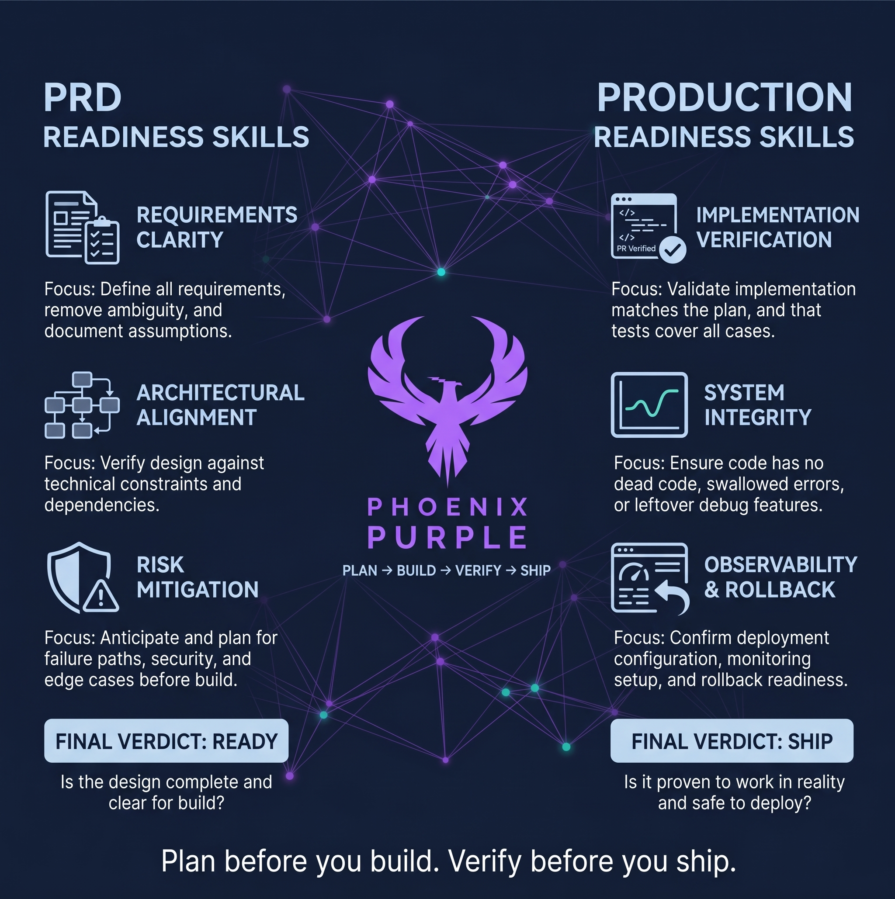
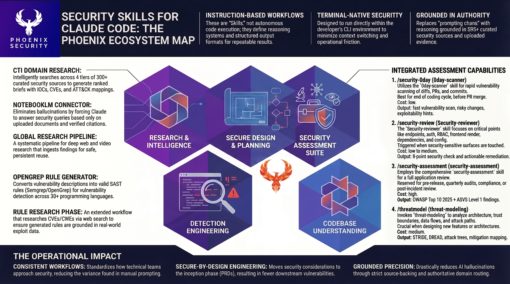
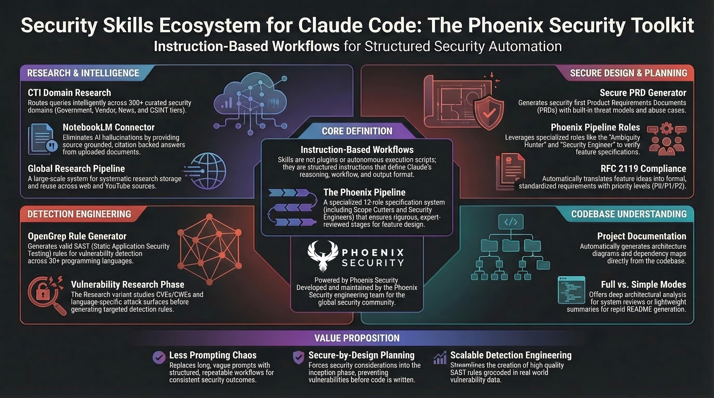
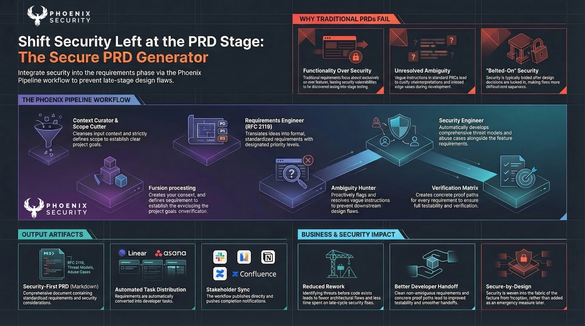
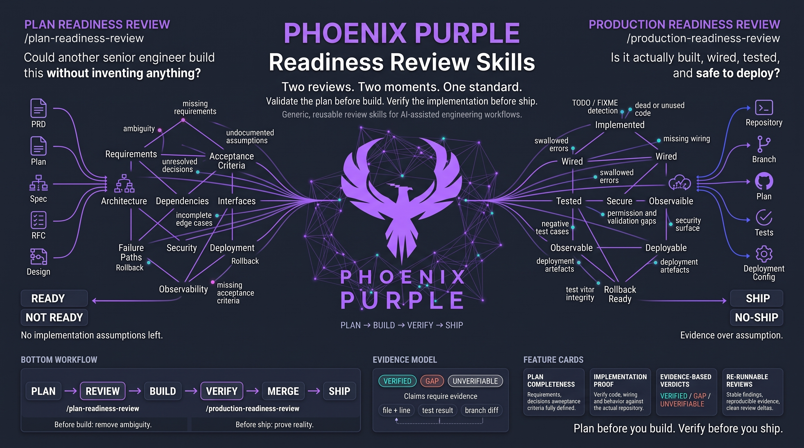
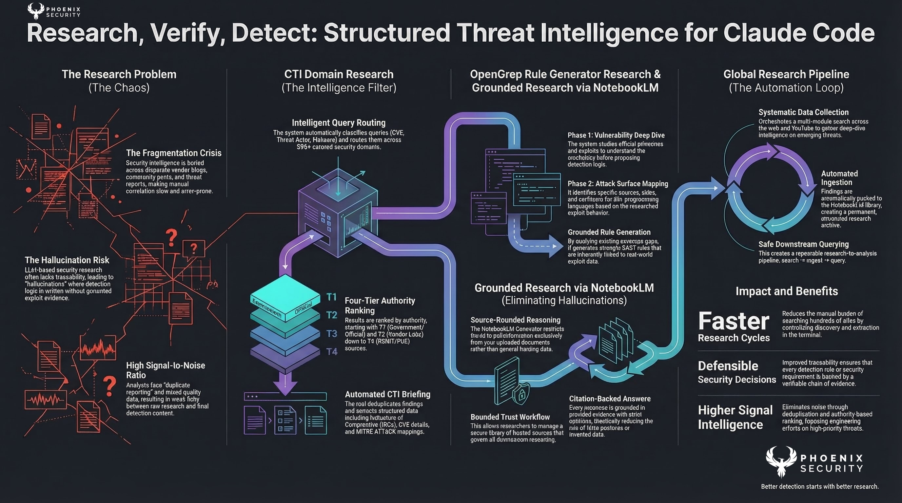
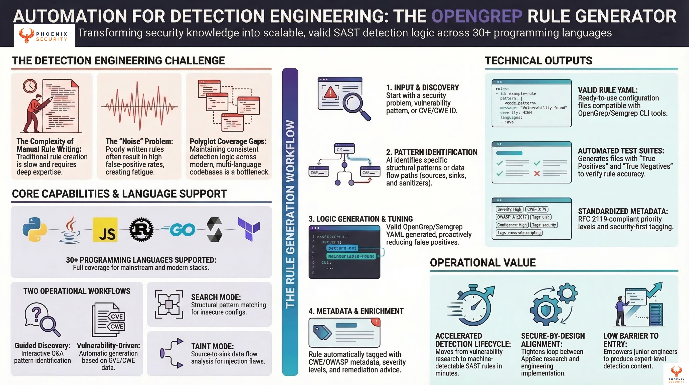
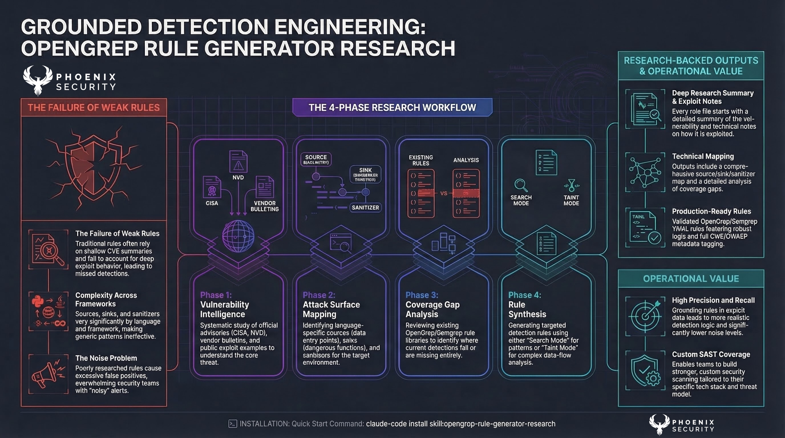
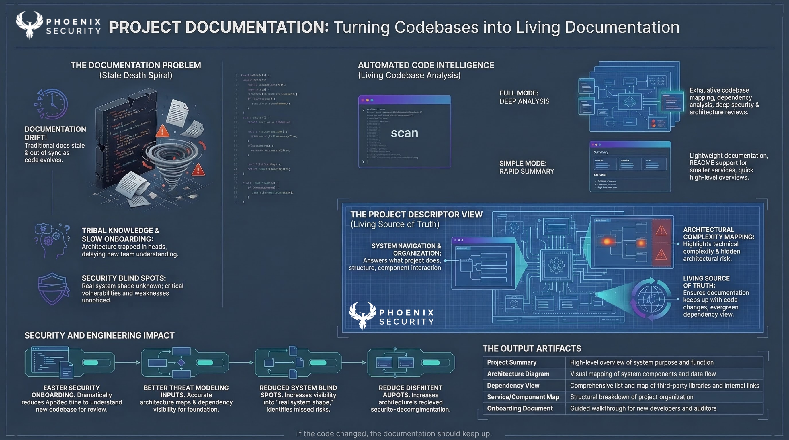
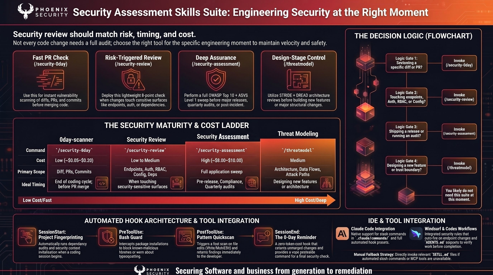

# Security Skills for Claude Code — Open Source Security Automation Toolkit

**The open-source security automation toolkit for [Claude Code](https://claude.ai)** — CTI research, SAST rule generation, secure PRD creation, vulnerability analysis, and AI-powered security engineering workflows. Built by [Phoenix Security](https://phoenix.security) for the global AppSec, DevSecOps, and security research community.

[](LICENSE)
[](https://claude.ai)
[](CONTRIBUTING.md)

> Search 595+ threat intelligence sources, generate opengrep/semgrep SAST rules for 30+ languages, create security-focused product requirements with STRIDE threat models, review a plan or a codebase before it ships, query NotebookLM for citation-backed research, and auto-generate living project documentation — all from your terminal with Claude Code.

---

## Install in 30 seconds

Everything in this repository installs as **six Claude Code plugins** from one marketplace.
Paste this into Claude Code:

```
/plugin marketplace add Security-Phoenix-demo/security-skills-claude-code
/plugin install phoenix-security-review@phoenix-security
/plugin install phoenix-readiness-reviews@phoenix-security
/plugin install phoenix-sast-rules@phoenix-security
/plugin install phoenix-cti-search@phoenix-security
/plugin install phoenix-prd-pipeline@phoenix-security
/plugin install phoenix-docs-research@phoenix-security
```

Install only the plugins you want — each one stands alone. Full detail, team-wide
auto-install, and troubleshooting: **[Marketplace Installation Guide](MARKETPLACE_INSTALL.md)**.

---

## New — Readiness Review Gates

Two adversarial review gates that answer the two questions that actually decide whether
work is ready to move: **is the plan implementable**, and **is the code actually shippable**.



| Skill | Input | Question it answers | Verdict |
|---|---|---|---|
| `plan-readiness-review` | PRD, plan, spec, RFC, design doc | Could a different senior engineer build this without inventing requirements, schemas, API contracts or error handling? | **READY / NOT READY** |
| `production-readiness-review` | Repo + branch + the plan | Is it actually built, wired, tested, and safe to deploy? | **SHIP / NO-SHIP** |

Both refuse to hand you an invented number. Percentages carry counts (`68% (23/34 VERIFIED)`),
results are three-state (VERIFIED / GAP / UNVERIFIABLE) so "I could not check this" stops
collapsing into a pass, and every absence claim must cite the search that returned zero hits.
`production-readiness-review` runs a **deterministic repo scanner** first, so its evidence is
reproducible and two runs diff cleanly instead of depending on what the model happened to read.

```
/plugin install phoenix-readiness-reviews@phoenix-security
```

Then just ask — or type `/plan-readiness-review` / `/production-readiness-review`.
Full reference: [Readiness & Review Gates](#readiness--review-gates).

---

## Table of Contents




- [Install in 30 seconds](#install-in-30-seconds)
- [New — Readiness Review Gates](#new--readiness-review-gates)
- [Powered by Phoenix Security — Open-Source Companion to the Platform](#powered-by-phoenix-security--open-source-companion-to-the-platform)
- [What Is This Repository?](#what-is-this-repository)
- [What's Included](#whats-included)
  - [The six plugins](#the-six-plugins)
  - [All 27 skills](#all-27-skills)
  - [Feature Descriptor — Phoenix Pipeline](#feature-descriptor--phoenix-pipeline)
- [Quick Start](#quick-start)
- [Repository Structure](#repository-structure)
- [Readiness & Review Gates](#readiness--review-gates)
- [Research & Intelligence Skills](#research--intelligence-skills)
  - [1. CTI Domain Research](#1-cti-domain-research--automated-threat-intelligence-gathering)
  - [2. NotebookLM Connector](#2-notebooklm-connector--source-grounded-ai-research-with-zero-hallucinations)
  - [3. Global Research Pipeline](#3-global-research-pipeline--automated-intelligence-collection-and-ingestion)
- [Security Generation & Remediation Skills](#security-generation--remediation-skills)
  - [1. Secure PRD Generator](#1-secure-prd-generator--shift-security-left-to-the-requirements-stage)
  - [2. OpenGrep Rule Generator](#2-opengrep-rule-generator--ai-powered-sast-rule-creation)
  - [3. OpenGrep Rule Generator Research](#3-opengrep-rule-generator-research--vulnerability-first-detection-engineering)
  - [4. Project Documentation](#4-project-documentation--turn-any-codebase-into-living-documentation)
  - [5. Security Assessment Suite](#5-security-assessment-suite--four-appsec-skills--active-hooks)
- [Plugins Reference](#plugins-reference)
  - [CTI Search Plugin](#1-cti-search-plugin)
  - [Secure PRD Plugin](#2-secure-prd-plugin)
- [Phoenix Pipeline — Feature Descriptor](#phoenix-pipeline--feature-descriptor)
- [Domain Tiers](#domain-tiers)
- [NotebookLM Integration](#notebooklm-integration)
- [Configuration](#configuration--customization)
- [Contributing](#contributing)
- [Frequently Asked Questions (FAQ)](#frequently-asked-questions-faq)
- [License](#license)
- [Support](#support)
- [Acknowledgments](#acknowledgments)

---

## Overview

---

## Powered by Phoenix Security — Open-Source Companion to the Platform

This repository is the **open-source companion** to the **[Phoenix Security](https://phoenix.security)** platform. Each skill here distills a slice of what Phoenix does at platform scale into something you can run locally inside Claude Code. If a skill earns its keep in your workflow and you need it across hundreds of repos, with real reachability data, exploit chains, and team-level SLAs, the corresponding Phoenix product area is where to go next.

### Phoenix Platform — Four Unified Product Areas

| Area | Tagline | What it does | Open-source slice in this repo |
|---|---|---|---|
| **🟠 Orange — Attribution & Prioritization** | One backlog per team | Single backlog with code→cloud reachability and business context. Normalizes 30+ scanners, dedupes, and routes to owners with SLAs. | — (platform-only) |
| **🟣 [Purple — Identification & Prevention](https://phoenix.security/phoenix-purple-ai-sast-sca-ai-generated-code/)** | Stop bad code before merge | Graph-powered SAST and exploit intelligence. Traces real taint paths, composes multi-step chains, prevents issues at PR and agent time. | **[Security Assessment Suite](plugins/phoenix-security-review/)** + **[OpenGrep Rule Generator](plugins/phoenix-sast-rules/skills/opengrep-rule-generator/)** + **[Secure PRD Generator](plugins/phoenix-prd-pipeline/skills/prd-generator/)** |
| **🔵 [Blue — Threat Intelligence & Supply-Chain Firewall](https://phoenix.security/phoenix-blue-ai-vulnerability-intelligence-cve-scoring/)** | Block bad packages before install | Adversarially validated intelligence fused into a single decision. Enforces at agent, install, CI, and deploy to block malicious or unsafe packages pre-execution. | **[CTI Domain Research](plugins/phoenix-cti-search/skills/cti-domain-research/)** + **[NotebookLM Connector](plugins/phoenix-docs-research/skills/notebooklm/)** + the **PreToolUse Bash package guard hook** in the Security Assessment Suite |
| **🟢 Green — Agentic Remediation** | Minimal-diff fix PRs | Minimal-diff PRs, safe alternatives, negative tests, and change plans tied to proven attack paths. Closes the loop with measurable risk reduction. | — (platform-only — coming to OSS) |

**When the open-source skills aren't enough:**

- **Need cross-repo reachability and prioritization?** → Phoenix Orange
- **Need multi-step taint analysis with real exploit chains?** → [Phoenix Purple](https://phoenix.security/phoenix-purple-ai-sast-sca-ai-generated-code/)
- **Need adversarially validated CVE intel + install-time blocking?** → [Phoenix Blue](https://phoenix.security/phoenix-blue-ai-vulnerability-intelligence-cve-scoring/)
- **Need agentic remediation with measurable risk reduction?** → Phoenix Green

The skills in this repo are designed to be useful on day one, with no Phoenix backend required. They share Phoenix's design philosophy: short feedback loops, severity-ranked findings, no padding, no 30-page reports.

---

## What Is This Repository?

This repository is a **curated collection of security skills, plugins, and automation pipelines** for [Claude Code](https://claude.ai) — Anthropic's official CLI for AI-assisted software engineering. It turns Claude Code into a comprehensive **security engineering workstation** capable of threat intelligence research, vulnerability detection rule generation, secure requirements engineering, and automated security documentation.

Built and maintained by the **security engineering team at [Phoenix Security](https://phoenix.security)** and released as open source under the MIT License. Every skill is designed for real-world security workflows: incident response research, AppSec shift-left, SAST pipeline creation, compliance documentation, and security architecture review.

**Built for security professionals who use AI to work faster and more accurately:**

- **Security engineers and SOC analysts** — automate CTI gathering across 595+ sources with authority-ranked results and MITRE ATT&CK mapping
- **DevSecOps teams** — generate security-focused PRDs with STRIDE threat models before writing a single line of code
- **AppSec professionals** — create opengrep/semgrep SAST rules for 30+ languages with built-in false positive reduction and CWE/OWASP tagging
- **Vulnerability researchers** — research CVEs with web search, then auto-generate detection rules grounded in real exploit data
- **Penetration testers and red teamers** — gather OSINT and push findings to NotebookLM for citation-backed analysis
- **Engineering managers** — auto-generate living project documentation with architecture maps, dependency views, and self-healing CI
- **Anyone using Claude Code** — extend your terminal with structured, repeatable security automation workflows

---

## What's Included




### The six plugins

Everything ships as a Claude Code plugin. One `/plugin install` per plugin — no copying
folders, no editing settings by hand. Each plugin holds one or more **skills**; a skill is
an instruction-based workflow that also gives you a slash command of the same name.

| Plugin | What it gives you | Skills | Install |
|---|---|---|---|
| **[phoenix-security-review](plugins/phoenix-security-review/)** | AppSec review across the whole lifecycle: multi-language reviewer, whole-repo OWASP/ASVS sweep, diff-scoped 0-day scan, STRIDE/DREAD threat model, and two threat-model-driven tiers. Plus 4 slash commands, 1 subagent, 3 opt-in hooks. | 6 | `/plugin install phoenix-security-review@phoenix-security` |
| **[phoenix-readiness-reviews](plugins/phoenix-readiness-reviews/)** | The two review gates: is the plan implementable, and is the code shippable. Deterministic repo scanner included. | 2 | `/plugin install phoenix-readiness-reviews@phoenix-security` |
| **[phoenix-sast-rules](plugins/phoenix-sast-rules/)** | opengrep/semgrep rule generation for 30+ languages, with an optional CVE/CWE research pass first. | 2 | `/plugin install phoenix-sast-rules@phoenix-security` |
| **[phoenix-cti-search](plugins/phoenix-cti-search/)** | Threat intelligence search across 595 curated domains in 4 authority tiers. Skill needs no API key; bundled Node CLI, MCP server and `/cti-search` command. | 1 | `/plugin install phoenix-cti-search@phoenix-security` |
| **[phoenix-prd-pipeline](plugins/phoenix-prd-pipeline/)** | Security-first specifications: a one-shot PRD generator plus the 12 Phoenix Pipeline roles, stage by stage. | 13 | `/plugin install phoenix-prd-pipeline@phoenix-security` |
| **[phoenix-docs-research](plugins/phoenix-docs-research/)** | A 6-mode self-healing project documenter, a NotebookLM connector for citation-backed answers, and a web + YouTube research pipeline. | 3 | `/plugin install phoenix-docs-research@phoenix-security` |

### All 27 skills

Each one is also a slash command named after it.

| Skill | Plugin | Description |
|---|---|---|
| `plan-readiness-review` | readiness-reviews | Adversarial review of a PRD, plan, spec or RFC. Verdict: READY / NOT READY |
| `production-readiness-review` | readiness-reviews | Adversarial review of a real codebase against its plan. Verdict: SHIP / NO-SHIP |
| `security-reviewer` | security-review | Multi-language 8-point pre-merge review (Python, JS/TS, Go, Java/Kotlin, Rust, Ruby, .NET) |
| `security-assessment` | security-review | Whole-repo OWASP Top 10 2025 + ASVS Level 1 sweep |
| `0day-scanner` | security-review | Diff-scoped zero-day analysis of a commit, PR, file or branch |
| `threat-modeling` | security-review | STRIDE + DREAD threat model extracted from the code |
| `tm-quick-security-assessment` | security-review | Quick tier — threat-model-aware pre-merge pass on what changed |
| `tm-security-review` | security-review | Comprehensive tier — full threat model, then triple-pass exploit review with a runnable PoC |
| `opengrep-rule-generator` | sast-rules | Write opengrep/semgrep pattern and taint rules for 30+ languages |
| `opengrep-rule-generator-research` | sast-rules | Research a CVE or CWE with web search first, then write the detection rules |
| `cti-domain-research` | cti-search | Tiered threat-intelligence search across 595 security domains. No API key needed |
| `prd-generator` | prd-pipeline | Full security-focused PRD with a threat model, from a plain-language description |
| `phoenix-pipeline-navigator` | prd-pipeline | Interactive guide and launcher for the 10-role pipeline |
| `phoenix-orchestrator` | prd-pipeline | Runs roles 01–10 end to end |
| `phoenix-context-curator` | prd-pipeline | Role 01 — cleans raw notes, tickets and threads into CLEAN_CONTEXT |
| `phoenix-scope-cutter` | prd-pipeline | Role 02 — explicit in-scope / out-of-scope |
| `phoenix-constraint-distiller` | prd-pipeline | Role 03 — constraints and acceptance criteria |
| `phoenix-requirements-engineer` | prd-pipeline | Role 04 — RFC 2119 requirements with stable IDs |
| `phoenix-ambiguity-hunter` | prd-pipeline | Role 05 — red-teams the requirements for ambiguity |
| `phoenix-security-engineer` | prd-pipeline | Role 06 — threat model and abuse cases |
| `phoenix-contract-architect` | prd-pipeline | Role 07 — API design, events, error taxonomy |
| `phoenix-verification-matrix` | prd-pipeline | Role 08 — a proof path for every MUST |
| `phoenix-batch-planner` | prd-pipeline | Role 09 — incremental, verifiable delivery slices |
| `phoenix-final-gate` | prd-pipeline | Role 10 — SHIP / NO_SHIP with a blocker list |
| `project-documenter` | docs-research | Generates and self-heals a full documentation pack across 6 modes |
| `notebooklm` | docs-research | Queries Google NotebookLM for citation-backed, source-grounded answers |
| `phoenix-research-pipeline` | docs-research | Web + YouTube research, then pushes sources into NotebookLM |

### Feature Descriptor — Phoenix Pipeline




The **Phoenix Pipeline** is a 12-role specification system for producing rigorous, security-aware product requirements. Each role is a dedicated skill file.

| Role | Skill | Purpose |
|------|-------|---------|
| Pipeline Navigator | `phoenix-pipeline-navigator` | Orchestrates the full pipeline |
| Context Curator | `phoenix-context-curator` | Extracts and cleanses input context |
| Scope Cutter | `phoenix-scope-cutter` | Defines in/out scope and goals |
| Constraint Distiller | `phoenix-constraint-distiller` | Identifies constraints and acceptance criteria |
| Requirements Engineer | `phoenix-requirements-engineer` | Creates RFC 2119 requirements with IDs |
| Ambiguity Hunter | `phoenix-ambiguity-hunter` | Flags and resolves ambiguities |
| Security Engineer | `phoenix-security-engineer` | Develops threat models and abuse cases |
| Contract Architect | `phoenix-contract-architect` | Designs APIs, events, and error taxonomy |
| Verification Matrix | `phoenix-verification-matrix` | Creates proof paths for every requirement |
| Batch Planner | `phoenix-batch-planner` | Plans incremental, verifiable delivery |
| Final Gate | `phoenix-final-gate` | Go/no-go decision with blocker list |
| Orchestrator | `phoenix-orchestrator` | Coordinates all roles and manages flow |

> All 12 roles ship inside the `phoenix-prd-pipeline` plugin:
> [`plugins/phoenix-prd-pipeline/skills/`](plugins/phoenix-prd-pipeline/skills/).
> Install it once and every role is available as a skill and a slash command.

---

## Quick Start

### Prerequisites

- [Claude Code](https://claude.ai) installed
- Node.js 18+ (for plugins)
- A search API key — [Brave Search](https://api.search.brave.com/app/keys) (recommended, 2,000 free requests/month) or [SerpAPI](https://serpapi.com) (100 free/month)

### Installation

#### Method 1 — plugin marketplace (recommended)

One marketplace, six plugins. Type these in Claude Code:

```
/plugin marketplace add Security-Phoenix-demo/security-skills-claude-code
/plugin install phoenix-security-review@phoenix-security
/plugin install phoenix-readiness-reviews@phoenix-security
/plugin install phoenix-sast-rules@phoenix-security
/plugin install phoenix-cti-search@phoenix-security
/plugin install phoenix-prd-pipeline@phoenix-security
/plugin install phoenix-docs-research@phoenix-security
```

Install only what you need. `/plugin` opens the browser UI if you would rather click.

Prefer the terminal? The same thing works outside a session:

```bash
claude plugin marketplace add Security-Phoenix-demo/security-skills-claude-code
claude plugin install phoenix-readiness-reviews@phoenix-security
claude plugin list
```

**Team-wide auto-install** — commit this to your repo's `.claude/settings.json` and every
teammate gets the plugins on their next session:

```json
{
  "extraKnownMarketplaces": {
    "phoenix-security": {
      "source": {
        "source": "github",
        "repo": "Security-Phoenix-demo/security-skills-claude-code"
      }
    }
  },
  "enabledPlugins": {
    "phoenix-security-review@phoenix-security": true,
    "phoenix-readiness-reviews@phoenix-security": true
  }
}
```

Updating later: `/plugin update phoenix-security-review@phoenix-security`, or
`/plugin marketplace update phoenix-security` to refresh the catalogue.

See the **[Marketplace Installation Guide](MARKETPLACE_INSTALL.md)** for troubleshooting,
scopes, and how to test a local checkout before you push.

#### Method 2 — local checkout (for development)

Point the marketplace at a directory instead of a repo. Edits land immediately, so this is
the loop to use while writing or changing a skill:

```bash
git clone https://github.com/Security-Phoenix-demo/security-skills-claude-code.git
cd security-skills-claude-code
claude plugin marketplace add "$(pwd)"
claude plugin install phoenix-readiness-reviews@phoenix-security
```

Validate before you commit:

```bash
claude plugin validate .                                   # the marketplace manifest
claude plugin validate plugins/phoenix-security-review     # one plugin manifest
claude plugin validate --strict plugins/phoenix-security-review  # its skills, commands, agents
python3 scripts/validate-marketplace.py                    # does everything fit together?
```

#### Method 3 — copy a single skill

A skill directory is self-contained. Copy one in and it becomes a slash command named after
the directory, with no manifest needed:

```bash
# personal — available in every project on this machine
cp -r plugins/phoenix-readiness-reviews/skills/* ~/.claude/skills/

# or project-scoped, committed so the team gets it
cp -r plugins/phoenix-readiness-reviews/skills/* .claude/skills/
```

Claude Code watches these directories, so an edit lands in the running session without a
restart. Note that `~/.claude/skills/` is **not** read by Cowork or cloud sessions — use the
plugin route for those.

#### After installing — Node and API keys

Only `phoenix-cti-search` needs either. Its `cti-domain-research` skill works with no setup;
the bundled CLI and MCP server need Node 18+ and a search key:

```bash
CTI=~/.claude/plugins/marketplaces/phoenix-security/plugins/phoenix-cti-search
cd "$CTI" && npm install --omit=dev
cp .env.example .env   # then set BRAVE_SEARCH_API_KEY
```

---

## Repository Structure

```
security-skills-claude-code/
│
├── .claude-plugin/
│   └── marketplace.json                   # the marketplace manifest — this is what
│                                          # /plugin marketplace add reads
│
├── README.md                              # this file — start here
├── MARKETPLACE_INSTALL.md                 # installation guide + troubleshooting
├── CONTRIBUTING.md                        # how to add a skill or a plugin
├── LICENSE                                # MIT
│
└── plugins/                               # one directory per plugin
    │
    ├── phoenix-security-review/           # 6 skills, 4 commands, 1 agent, 3 hooks
    │   ├── .claude-plugin/plugin.json
    │   ├── skills/
    │   │   ├── security-reviewer/         # canonical multi-language reviewer
    │   │   │   ├── languages/             # 7 per-language reference packs
    │   │   │   ├── checklists/            # OWASP/ASVS + endpoint
    │   │   │   └── playbooks/triage.md
    │   │   ├── security-assessment/       # whole-repo OWASP + ASVS L1
    │   │   ├── 0day-scanner/              # diff-scoped exploit analysis
    │   │   ├── threat-modeling/           # STRIDE + DREAD
    │   │   ├── tm-quick-security-assessment/
    │   │   └── tm-security-review/
    │   ├── commands/                      # /security-review /security-0day
    │   │                                  # /security-audit /threatmodel
    │   ├── agents/security-reviewer.md    # the review subagent
    │   ├── hooks/                         # SessionStart / PreToolUse / PostToolUse
    │   ├── install/                       # opt-in hook wiring, Windsurf, Codex
    │   └── references/                    # tester templates, suite notes
    │
    ├── phoenix-readiness-reviews/         # 2 skills
    │   ├── .claude-plugin/plugin.json
    │   └── skills/
    │       ├── plan-readiness-review/
    │       │   └── references/            # ambiguity patterns, output template
    │       └── production-readiness-review/
    │           ├── references/            # verification checklists, output template
    │           └── scripts/scan_repo.sh   # deterministic evidence collector
    │
    ├── phoenix-sast-rules/                # 2 skills
    │   └── skills/
    │       ├── opengrep-rule-generator/
    │       └── opengrep-rule-generator-research/
    │
    ├── phoenix-cti-search/                # 2 skills + CLI + MCP server
    │   ├── skills/cti-domain-research/
    │   ├── commands/cti-search.md
    │   ├── index.js                       # CLI entry point
    │   ├── mcp-server.js                  # MCP tool server
    │   ├── data/domains.txt               # 595 curated security domains
    │   └── data/tier-map.json             # tier + authority scores
    │
    ├── phoenix-prd-pipeline/              # 13 skills
    │   ├── skills/prd-generator/          # one-shot PRD + threat model
    │   ├── skills/phoenix-*/              # the 12 pipeline roles
    │   └── dist/claude-ai-web/            # the Claude.ai web UI variant
    │
    └── phoenix-docs-research/             # 3 skills
        ├── skills/project-documenter/     # 6 modes, incl. self-heal
        ├── skills/notebooklm/             # browser automation + scripts
        ├── skills/phoenix-research-pipeline/
        └── docs/                          # per-skill long-form docs
```

Every `dist/` directory holds the packaged `.skill` bundles for uploading to claude.ai —
they are distribution artefacts, not something Claude Code loads.

---

## Readiness & Review Gates

**Plugin:** [`plugins/phoenix-readiness-reviews/`](plugins/phoenix-readiness-reviews/) ·
`/plugin install phoenix-readiness-reviews@phoenix-security`

Two gates, split by what is under review. Run the plan gate before build. Run the production
gate before merge or release. The production gate assumes the plan exists but never trusts it.



Left: every input the plan gate accepts, the gaps it hunts for, and the READY / NOT READY
decision. Right: what the production gate proves against the real repository, and the
SHIP / NO-SHIP decision. Bottom: where each gate sits in the workflow, and the three-state
evidence model both share.

| Skill | Input | Question | Verdict |
|---|---|---|---|
| `plan-readiness-review` | PRD / plan / spec / RFC / design | Could another senior engineer build this without inventing anything? | READY / NOT READY |
| `production-readiness-review` | Repo + branch + plan | Is it actually built, wired, tested, and safe to deploy? | SHIP / NO-SHIP |

### 1. Plan Readiness Review — Catch the Gap Before Anyone Writes Code

One question decides everything: **could a competent senior engineer who was not in any of
the meetings implement this correctly, without inventing anything?** Anything an implementer
would have to decide for themselves is a gap in the plan, not a detail for later — a guess is
an unreviewed product decision made by whoever happened to pick up the ticket.

**What it produces:**

- A requirement inventory with stable IDs, so a re-run reports a delta and not a fresh list.
- A per-requirement verdict backed by a document anchor you can go and read.
- An unresolved-assumption register — the decisions nobody has actually made yet.
- A counted READY / NOT READY, and the precise change that would flip it.

It reads a bundled ambiguity-pattern reference during the review: the specific phrasings that
reliably survive plan review and then produce two engineers building two different things.
Undefined magnitude, undefined actor, undefined scope of "all", verbs that hide a design
decision, error-handling non-statements.

**Example prompts:**

```
/plan-readiness-review docs/payments-prd.md
review this spec before we build it
is this ready to implement?
poke holes in this plan
will an engineer know what to build from this?
```

### 2. Production Readiness Review — Try to Disprove That the Work Is Done

The plan is a claim. The commit history is a claim. A passing test suite is a weaker claim
than it looks. Only the code, its wiring, its configuration and its behaviour under failure
are evidence. This skill tries to **disprove that the work is finished** and reports what
survived the attempt.

**Phase 1 is a deterministic scan.** `scripts/scan_repo.sh` emits `path:line` for every hit,
under seven sections: incompleteness markers, silent failure and swallowed errors, debug and
dev leftovers, security surface (secret-shaped literals, routes counted against auth markers,
injection-prone patterns, disabled TLS checks), config/flags/migrations/deploy including which
artefacts are missing, test surface, and the change surface vs a base ref. It skips test paths
and vendor directories, needs only bash and grep, and uses ripgrep when present. Output is deterministic, so two
runs diff cleanly and the review's evidence is reproducible rather than dependent on what the
model happened to read.

The scanner is useful on its own:

```bash
SKILL=~/.claude/plugins/marketplaces/phoenix-security/plugins/phoenix-readiness-reviews/skills/production-readiness-review
bash "$SKILL/scripts/scan_repo.sh" /path/to/repo --base origin/main > scan.md
bash "$SKILL/scripts/scan_repo.sh" . --base main --exclude 'generated/'
```

**What the review then does with those leads:**

- Traces every requirement end to end — UI, API, service, persistence, jobs, config,
  migrations, deploy. Wiring gets its own pass, with a named list of the "exists but is dead"
  traps.
- Checks **test integrity by breaking the code** and confirming a test fails, instead of
  trusting test counts and coverage percentages.
- Runs per-domain security checks with required evidence for each, not one bullet labelled
  "security".
- Separates audit from remediation with a hard gate. Fixing while auditing destroys the
  record of what actually shipped. Remediation runs only when you authorise it, and only up
  to the severity you name.
- Ranks issues by a severity rubric rather than intuition, with stable IDs.

**Example prompts:**

```
/production-readiness-review
is this actually implemented?
verify the implementation against the PRD
pre-merge review of this branch vs origin/main
ship or no-ship?
```

**What comes back** — a counted Verdict block first, then the blocking issues:

```markdown
## Verdict

**PRODUCTION READY: NO**

- Plan completeness: **91%** (31 READY / 34 requirements)
- Implementation completeness: **74%** (25 VERIFIED / 34; 7 GAP, 2 UNVERIFIABLE)
- Open issues: 1 Critical, 3 High, 5 Medium, 2 Low
- Scope: repo `.` @ `a1b2c3d` vs base `origin/main`; plan `payments-prd.md v1.4`
- Verdict rule applied: NO-SHIP while any Critical or High is open

## Blocking issues

- P-001 [Critical] `GET /v1/findings/{id}` has no tenant check — findings/api.py:212
- P-004 [High] refund handler catches and drops every exception — billing/refund.py:88
```

Then the per-requirement inventory, the remaining work with owners, and an evidence log of
what was actually executed — so the review's limits are visible rather than implied.

### Why the verdicts are trustworthy

| Rule | Why |
|---|---|
| Percentages carry counts — `68% (23/34 VERIFIED)` | A bare percentage from a language model is an invented number |
| Three states: VERIFIED / GAP / UNVERIFIABLE | "I could not check this" must not collapse into a pass or a fail |
| Absence claims cite the search that returned zero hits | Makes the review falsifiable instead of merely confident |
| Audit and remediation split by a hard gate | Fixing while auditing destroys the record of what shipped |
| Stable issue IDs | A re-run reports a delta, not a fresh list |

---

## Research & Intelligence Skills

Skills that gather, organize, and verify external knowledge — threat intel, vendor docs, vulnerability research — and feed it into your workflow with citation-backed accuracy.

### 1. CTI Domain Research — Automated Threat Intelligence Gathering

**Folder:** [`plugins/phoenix-cti-search/skills/cti-domain-research/`](plugins/phoenix-cti-search/skills/cti-domain-research/)



Stop manually searching BleepingComputer, Krebs on Security, and vendor blogs one tab at a time. The **CTI Domain Research** skill transforms Claude Code into a structured threat intelligence platform that searches **595+ curated security domains** in seconds — covering government advisories, vendor research labs, security news, and OSINT sources in a single query.

The skill uses a **four-tier authority ranking system** to ensure the most trustworthy sources surface first. When you search for a CVE, it automatically prioritizes CISA, NVD, and MSRC (Tier 1) before checking Unit42, Talos, and Securelist (Tier 2). Threat actor queries route to vendor research blogs first. Exploit searches hit GreyNoise, VulnCheck, and AttackerKB. Every result is deduplicated, scored by source authority and recency, and returned as a structured CTI brief with extracted CVE IDs, MITRE ATT&CK technique mappings, and observed IOCs.

The optional `--notebooklm` flag pushes all discovered source URLs directly into a Google NotebookLM notebook, creating a permanent, citation-backed research archive that you can query later with zero hallucination risk. This turns a one-off search into a reusable knowledge base.

**Example prompts:**
```
Search for threat intelligence on CVE-2024-21762
Find recent LockBit ransomware reports across vendor blogs
What are security vendors saying about ALPHV BlackCat?
Research MITRE T1190 exploitation techniques and push to NotebookLM
Collect CTI on supply chain attacks targeting npm packages
```

**How it works:**
1. **Query classification** — automatically detects whether you're searching for a CVE, threat actor, malware family, exploit, or general topic
2. **Intelligent tier routing** — selects the most relevant domain tiers based on query type
3. **Batched site-scoped search** — constructs `site:` queries across domain batches using Brave Search or SerpAPI
4. **Authority-ranked deduplication** — removes duplicates, scores results by source tier and recency
5. **IOC and TTP extraction** — pulls CVE IDs, MITRE ATT&CK T-IDs, and IP indicators from result snippets
6. **Structured output** — returns a CTI brief with key findings, source table, observed tags, and next steps

---

### 2. NotebookLM Connector — Source-Grounded AI Research with Zero Hallucinations

**Folder:** [`plugins/phoenix-docs-research/skills/notebooklm/`](plugins/phoenix-docs-research/skills/notebooklm/)

LLM-based security research has a fundamental problem: hallucinations. When Claude can't find something in your uploaded documents, it fills the gap with plausible-sounding but potentially incorrect information — a dangerous failure mode when you're writing detection logic, threat models, or security requirements. The **NotebookLM Connector** solves this by routing questions through [Google NotebookLM](https://notebooklm.google.com/), which answers exclusively from your uploaded documents with strict citation backing.

Every response from NotebookLM is grounded in the specific documents you've uploaded — PDFs, Google Docs, websites, GitHub repos, YouTube videos. If the information isn't in your sources, NotebookLM says so instead of inventing an answer. This makes it the ideal research backend for security work where accuracy is non-negotiable: vulnerability analysis, compliance documentation, API specification lookups, and threat model validation.

The skill manages a **notebook library** so Claude automatically selects the right notebook for your question. Ask about authentication best practices and it routes to your security-docs notebook. Ask about API endpoints and it hits your architecture notebook. Each question runs in a fresh browser session with persistent authentication, and the built-in follow-up mechanism ensures Claude asks comprehensive questions until the research is complete.

**Capabilities:**
- Query any NotebookLM notebook by ID or URL with citation-backed responses
- Smart notebook library management — add, remove, list, search, activate/deactivate notebooks
- Automatic content discovery — query a notebook to auto-populate its metadata before saving
- Browser automation with persistent Google authentication
- Iterative follow-up queries to build comprehensive understanding
- Coverage analysis to ensure all parts of your question are fully answered

**Example prompts:**
```
Query my security-docs notebook about authentication best practices
Add this NotebookLM URL to my library: https://notebooklm.google.com/notebook/abc123
What does my threat-model notebook say about SSRF risks?
Check my API docs for rate limiting implementation details
Search my notebooks for information about OAuth2 token rotation
```

**Key files:**
- `SKILL.md` — skill specification with decision flow and follow-up mechanism
- `README.md` — comprehensive setup guide with architecture diagram and examples
- `AUTHENTICATION.md` — step-by-step Google authentication setup
- `scripts/` — Python automation scripts (ask_question.py, notebook_manager.py, auth_manager.py)
- `references/` — API reference, troubleshooting guide, usage patterns

---

### 3. Global Research Pipeline — Automated Intelligence Collection and Ingestion

**Folder:** [`plugins/phoenix-docs-research/skills/phoenix-research-pipeline/`](plugins/phoenix-docs-research/skills/phoenix-research-pipeline/)

Individual searches give you snapshots. The **Global Research Pipeline** gives you systematic coverage. This skill orchestrates a multi-module research automation pipeline that collects intelligence from web searches and YouTube video transcripts, deduplicates and organizes findings, and pushes everything into Google NotebookLM for permanent, source-grounded querying.

The pipeline is designed for deep-dive research scenarios where you need to gather comprehensive intelligence on an emerging threat, a new vulnerability class, or a complex security topic. Instead of running individual searches and manually copying results, the pipeline handles the entire workflow: systematic data collection across web and video sources, automated deduplication, structured formatting, and batch ingestion into your NotebookLM research archive.

This creates a **repeatable research-to-analysis pipeline**: search → collect → deduplicate → ingest → query. Once findings are in NotebookLM, you can ask follow-up questions with full citation backing, cross-reference information across sources, and build on previous research without re-running searches.

**Pipeline stages:**
1. **Web research** — structured searches across relevant domains with finding extraction
2. **YouTube research** — locate and transcribe relevant video content (conference talks, vendor webinars, researcher presentations)
3. **Deduplication and organization** — remove duplicates, structure results for ingestion
4. **NotebookLM push** — batch-add all collected sources to your target notebook
5. **Downstream querying** — use the NotebookLM Connector skill to query your research with zero hallucination

**Example prompts:**
```
Research the latest ransomware trends and push findings to NotebookLM
Collect comprehensive intelligence on supply chain attacks targeting Python packages
Research cloud security misconfigurations across AWS, GCP, and Azure
```

---

## Security Generation & Remediation Skills


A focused set of skills that **generate, audit, or remediate security issues across the SDLC** — shifting security left into requirements, generating SAST detection rules from CVE/CWE research, documenting security-relevant architecture, and running diff-time / pre-merge / pre-release / design-time AppSec workflows on the codebase. Together they cover the full lifecycle from spec to ship.

### 1. Secure PRD Generator — Shift Security Left to the Requirements Stage

**Folder:** [`plugins/phoenix-prd-pipeline/skills/prd-generator/`](plugins/phoenix-prd-pipeline/skills/prd-generator/)


Traditional PRDs focus exclusively on features and leave security as an afterthought — discovered too late in testing, patched as a hotfix, or never addressed at all. The **Secure PRD Generator** integrates security into the requirements phase itself, running every feature description through a **10-role specification pipeline** that produces RFC 2119-compliant requirements with STRIDE threat models, abuse cases, and verification proof paths built in from the start.

Each role in the pipeline handles a specialized aspect of specification: the **Context Curator** cleanses and structures the input; the **Ambiguity Hunter** flags vague instructions that cause downstream design flaws; the **Requirements Engineer** formalizes requirements with MUST/SHOULD/MAY levels and structured IDs (R-FUNC-001, R-SEC-001); the **Security Engineer** develops comprehensive threat models and abuse cases alongside the functional requirements; and the **Verification Matrix** creates concrete proof paths for every MUST-level requirement to ensure full testability.

The skill integrates directly with your team's existing tools. It publishes the PRD to **Atlassian Confluence** via MCP, converts requirements into **Linear or Asana** tasks automatically, sends **Slack** notifications to stakeholders, mirrors documents to **Notion**, and drafts summary emails via **Gmail**. Every output follows a consistent security-first template with priority tags (P0/P1/P2) and traceable requirement chains.

**What it produces:**
- Security-first PRD in structured markdown with RFC 2119 requirement levels
- STRIDE threat model with identified assets, actors, entry points, and trust boundaries
- Cursor-compatible implementation plan for `.cursor/plans/`
- Confluence page published to your configured space
- Automated task distribution to Linear or Asana from the batch plan
- Stakeholder notifications via Slack and Gmail

**Example prompts:**
```
Write a PRD for a user authentication system with OAuth2 and MFA
Create a security-focused spec for a payment processing API
Plan this feature: real-time webhook delivery system. Owner: @jane. Space: ENG.
Generate requirements for a file upload service with virus scanning
```

---

### 2. OpenGrep Rule Generator — AI-Powered SAST Rule Creation

**Folder:** [`plugins/phoenix-sast-rules/skills/opengrep-rule-generator/`](plugins/phoenix-sast-rules/skills/opengrep-rule-generator/)



Writing effective SAST rules is slow, error-prone, and requires deep knowledge of both the vulnerability class and the rule engine's syntax. The **OpenGrep Rule Generator** automates the entire process — from vulnerability description to validated, production-ready opengrep/semgrep YAML rules with test cases, CWE metadata, and false positive reduction patterns.

The skill supports **30+ programming languages** including Python, JavaScript, TypeScript, Java, Go, Ruby, PHP, C#, Rust, Kotlin, Swift, Terraform/HCL, and Solidity. It generates two types of rules: **Search rules** for structural pattern matching (finding dangerous function calls, insecure configurations, hardcoded secrets) and **Taint rules** for data flow analysis (tracing untrusted input from sources through propagators to dangerous sinks, with sanitizer awareness).

Every generated rule includes built-in false positive reduction using `pattern-not`, `pattern-not-inside`, and `metavariable-regex` patterns. The skill also generates companion test files with clearly marked true positive and true negative cases so you can validate detection accuracy before deploying to your CI pipeline.

**Two workflows:**
- **Guided Discovery** — interactive Q&A where Claude asks about your codebase, frameworks, and threat model before generating targeted rules
- **Vulnerability-Driven** — provide a CVE, CWE, or OWASP category and get rules generated automatically with appropriate detection patterns

**Example prompts:**
```
Create an opengrep rule to detect SQL injection in Python Flask apps
Generate a taint analysis rule for XSS in React components
Write semgrep rules for OWASP Top 10 in Java Spring Boot
Detect hardcoded AWS credentials in any language
Build a rule to catch insecure deserialization in Python pickle usage
Generate Terraform rules to detect publicly exposed S3 buckets
```

**Key files:**
- `SKILL.md` — full skill specification with guided and vulnerability-driven workflows
- `RULES_SYNTAX.md` — comprehensive opengrep/semgrep syntax reference (patterns, operators, metavariables, taint mode)
- `OPENGREP_RULE_GENERATOR_PROMPT.md` — optimized system prompt for high-quality rule generation

---

### 3. OpenGrep Rule Generator Research — Vulnerability-First Detection Engineering

**Folder:** [`plugins/phoenix-sast-rules/skills/opengrep-rule-generator-research/`](plugins/phoenix-sast-rules/skills/opengrep-rule-generator-research/)



The standard OpenGrep Rule Generator works great when you already know the pattern you want to detect. But what if you're starting from a CVE advisory, a vulnerability class, or a vague report about a new attack technique? The **Research** variant adds a **4-phase vulnerability research pipeline** that uses web search and web fetch to study the vulnerability in depth before generating detection rules — producing significantly better, more targeted rules that are grounded in real-world exploit data.

This is the difference between writing a rule from a description and writing a rule from understanding. The research phase studies official advisories, analyzes proof-of-concept exploits, maps language-specific attack surfaces (sources, sinks, sanitizers, propagators), and reviews existing semgrep/opengrep rules to identify coverage gaps. The resulting rules are inherently linked to real exploit behavior, not abstract patterns.

**Research pipeline (4 phases):**
1. **Vulnerability deep dive** — search CVE/CWE databases, fetch CISA/NVD/MSRC advisories, study proof-of-concept exploits to understand the actual attack mechanics
2. **Attack surface mapping** — identify specific sources, sinks, and certifiers for the target programming language based on the researched exploit behavior
3. **Existing detection gap analysis** — search for existing semgrep/opengrep rules, analyze what they catch and miss, identify coverage blind spots
4. **Grounded rule generation** — generate SAST rules that are directly linked to the researched exploit patterns, with a research summary embedded in each rule file

**Example prompts:**
```
Research CVE-2024-21762 and create detection rules for it
Generate opengrep rules for CWE-89 (SQL Injection) in Python with full research
Investigate Log4Shell and build comprehensive detection coverage for Java
Research SSRF vulnerabilities in Node.js and create taint analysis rules
Study the MOVEit Transfer vulnerability and write detection rules
```

**When to use this vs. the standard OpenGrep Rule Generator:**
- Use **OpenGrep Rule Generator** when you already know the exact code pattern you want to detect
- Use **OpenGrep Rule Generator Research** when you're starting from a CVE ID, CWE class, or vulnerability description and need to understand the attack before building detection

---

### 4. Project Documentation — Turn Any Codebase into Living Documentation

**Folder:** [`plugins/phoenix-docs-research/skills/project-documenter/`](plugins/phoenix-docs-research/skills/project-documenter/)



Documentation drift is the silent killer of engineering velocity. Code evolves daily while docs go stale within weeks, creating security blind spots, tribal knowledge silos, and painful onboarding experiences. The **Project Documenter** skill reverse-engineers your entire codebase and produces a **three-layer hierarchical documentation system** that stays accurate because it's generated from the code itself.

The skill produces a compressed **DOC_INDEX.md** routing layer (~1-2k tokens, perfect for AI assistants), an engineering **CLAUDE.md** navigation map (150-300 lines for human developers), and a complete set of **/docs/** sub-documents containing all authoritative detail — architecture diagrams, dependency maps, API references, module guides, runtime flow descriptions, and onboarding walkthroughs. Nothing is duplicated across layers.

Available in **six modes** to match your needs: Express (full pack, zero questions), General (developer-facing docs), AI/LLM (prompt inventories, model architecture, agent safety), Architecture (system maps, data contracts, dependency graphs), Full (everything plus audit of existing docs), and Self-Heal (generates GitHub Actions CI, Cursor rules, and Python drift-detection scripts to keep docs permanently in sync with code changes).

**Output artifacts:**
- **Project Summary** — high-level overview of system purpose and function
- **Architecture Diagram** — visual mapping of system components and data flow
- **Dependency View** — comprehensive list and map of third-party libraries and internal links
- **Service/Component Map** — structural breakdown of project organization
- **Onboarding Document** — guided walkthrough for new developers and auditors
- **Self-Heal CI** (Mode 5) — GitHub Actions workflow + Python scripts that detect documentation drift automatically

**Example prompts:**
```
Document this project (Express mode — full pack, zero questions)
Generate architecture documentation for this codebase
Create AI/LLM documentation including prompt inventory and model guardrails
Set up self-healing documentation with GitHub Actions CI
```

**Key files:**
- `project-documenter.skill` — full skill definition (install in Claude.ai or Claude Code)
- `project-documenter-simpler.skill` — lightweight variant for quick documentation
- `HOW_IT_WORKS.md` — complete technical reference
- `MODES_REFERENCE.md` — detailed guide to every mode and its outputs
- `INSTALL.md` — step-by-step installation and first-run guide
- `TROUBLESHOOTING.md` — common issues and fixes

---

### 5. Security Assessment Suite — Four AppSec Skills + Active Hooks



**Folder:** [`plugins/phoenix-security-review/`](plugins/phoenix-security-review/) — see the [suite README](plugins/phoenix-security-review/README.md) for the full reference.

A self-contained AppSec automation kit: four slash commands covering the security lifecycle from **diff-time** to **design-time**, a multi-language pre-merge reviewer with subagent dispatch, four hooks (SessionStart, PreToolUse, PostToolUse, SessionEnd) that feed live security context to every agent, and a one-command installer that wires it all into Claude Code, Windsurf, or Codex.

**The four commands (when to use each):**

| Command | Use when | Cost | Skill it runs |
|---|---|---|---|
| `/security-0day [base-ref]` | End of a coding cycle, before opening a PR. Diff-only LLM scan. | Low (~$0.05–$0.20) | `0day-scanner` — with the language packs as on-disk fallback |
| `/security-review [scope]` | Endpoint, auth/RBAC, render, dependency, or config change. Pre-merge gate. | Low–Medium | `security-reviewer` — Python, JS/TS, Go, Java/Kotlin, Rust, Ruby, .NET |
| `/security-audit [scope]` | Pre-release, compliance audit, post-incident. Full OWASP Top 10 (2025) + ASVS Level 1 sweep. | High (~$8–$10) | `security-assessment` — with the OWASP/ASVS checklists as fallback |
| `/threatmodel [scope]` | Architecture review, new-feature design, compliance docs. | Medium | `threat-modeling` — STRIDE + DREAD with attack trees and a mitigation matrix |

Two more skills come with the plugin and have no command of their own — ask for them by name,
or let Claude pick them up from the request: `tm-quick-security-assessment` (quick tier — a
threat-model-aware pass over only what changed vs a base ref) and `tm-security-review`
(comprehensive tier — build the full STRIDE model, then a triple-pass HUNT → JUDGE → VERIFY
exploit review that proves a runnable PoC per confirmed finding).

**Active hooks (full preset only — opt out for the lite preset):**

- **`SessionStart`** fingerprints the project, runs a fast dependency audit (osv-scanner if installed, else npm/pip/cargo/go/bundle audits per ecosystem), and injects a `## SECURITY CONTEXT` block every agent reads before its first turn.
- **`PreToolUse` on `Bash`** gates `npm/yarn/pnpm/pip/uv/poetry/cargo/go get/gem/bundle/composer/dotnet add` invocations. Blocks known-malicious packages, asks on typosquats and brand-new packages.
- **`PostToolUse` on `Edit|Write|MultiEdit`** runs a fast pattern scan on every file write (SQL string formatting, `innerHTML`, hardcoded secrets, etc.) and feeds findings back via `additionalContext`.
- **`SessionEnd`** prints a one-line reminder to run `/security-0day` if your branch has unscanned changes vs `main`. Zero LLM cost.

**The hooks are opt-in.** Installing the plugin gives you the six skills, the four slash
commands and the subagent immediately. The three active hooks are *not* wired automatically,
because a `PreToolUse` gate on every Bash call and a scan on every file write should be your
decision, not a side effect of installing a plugin.

To wire them, run the bundled installer from your project root:

```bash
PLUGIN=~/.claude/plugins/marketplaces/phoenix-security/plugins/phoenix-security-review
bash "$PLUGIN/install/install.sh" --full
```

The installer:

1. Copies the four slash commands into `.claude/commands/`.
2. Merges the chosen hook preset into `.claude/settings.json` (uses `jq` if available; backs up your existing settings first; tracks installer-created files so `--uninstall` is clean).
3. Copies the security-reviewer subagent into `.claude/agents/` (full preset only).
4. Chmods all hook scripts.

**Variants:**

- `install.sh` *(default)* or `install.sh --lite` — slash commands + SessionEnd reminder hook only. Zero LLM cost.
- `install.sh --full` — everything in lite **plus** the three active hooks **plus** the subagent.
- `install.sh --dry-run [--lite|--full]` — preview without writing.
- `install.sh --uninstall` — remove commands + subagent, restore `.claude/settings.json` from the backup.

**Other tools:**

- **Windsurf** — `cp` a rule into `.windsurf/rules/` (auto-fires on endpoint/auth/render/dep changes) and two workflows (`/security-assessment`, `/threatmodel`) into `.windsurf/workflows/`. One-line install in the suite README.
- **Codex CLI** — `cat` the `AGENTS.md.snippet` onto your project's `AGENTS.md`. Codex has no hook system, so this is enforced as a behavioral instruction.

**Optional dependencies:**

- `jq` — recommended for clean settings.json merge (installer falls back to copy-paste instructions if absent).
- `ripgrep` — required by the post-edit-quickscan hook (already required by Claude Code itself).
- `osv-scanner` — optional; richer dependency audit at SessionStart. `brew install osv-scanner` or `go install github.com/google/osv-scanner/cmd/osv-scanner@latest`.

**Example prompts:**

```
/security-0day                         # scan diff vs main with the LLM 0-day scanner
/security-0day origin/release-1.4      # scan diff vs a different base ref
/security-review auth                  # 8-point check focused on auth surfaces
/security-audit backend                # full OWASP/ASVS sweep, backend only
/threatmodel src/payments/             # STRIDE + DREAD threat model for the payments component
```

**When the four skills overlap (and how to pick):**

```
Are you reviewing a specific diff/PR/commit?
├── Yes → /security-0day
└── No → Did the change touch endpoints/auth/render/deps/config?
        ├── Yes → /security-review
        └── No → Pre-release / quarterly audit?
                ├── Yes → /security-audit
                └── No → New feature / architecture design?
                        ├── Yes → /threatmodel
                        └── No → You probably don't need this suite right now.
```

**Key files** (all paths relative to `plugins/phoenix-security-review/`):

- `README.md` — suite overview, decision tree, hook reference, subagent details, cross-skill integration diagram, troubleshooting.
- `skills/security-reviewer/` — the canonical multi-language reviewer: the 8-point check, 7 per-language reference packs in `languages/`, OWASP/ASVS + endpoint checklists in `checklists/`, and a triage playbook in `playbooks/`. Also the on-disk fallback for `security-assessment` and `0day-scanner` when their MCP tools are unreachable.
- `commands/` — the four slash command definitions (each a thin wrapper over a skill).
- `agents/security-reviewer.md` — the review subagent.
- `hooks/` — the three hook scripts plus `lib/common.sh`.
- `install/install.sh` — the opt-in hook installer.
- `install/hooks/settings.{lite,full}.example.json` — ready-to-merge `.claude/settings.json` blocks.
- `install/windsurf/` — Windsurf rule + workflows.
- `install/codex/AGENTS.md.snippet` — Codex behavioural instruction.
- `references/security-analysis-agent/` — parameterised backend/frontend tester templates with `{{PLACEHOLDERS}}` (hydrate before use).

---

## Plugins Reference

### 1. CTI Search Plugin

**Folder:** [`plugins/phoenix-cti-search/`](plugins/phoenix-cti-search/)

The execution engine behind CTI searches. Available as a **CLI tool**, **MCP server**, or **slash command**.

#### Usage Modes

**Slash command:**
```
/cti-search CVE-2024-21762
/cti-search LockBit ransomware --full --since 30
/cti-search ALPHV --notebooklm --tier 2
```

**CLI:**
```bash
node index.js --query "CVE-2024-21762" --full
node index.js --query "LockBit" --tier 2 --since 30 --notebooklm
node index.js --query "supply chain attack npm" --json
```

**MCP tool (conversational):**
```
Use the CTI search tool to find recent ransomware reports
```

#### Flags

| Flag | Description | Default |
|------|-------------|---------|
| `--query <q>` | Search subject (required) | — |
| `--count <n>` | Results per tier | 10 |
| `--tier <1-4>` | Restrict to specific tier | All |
| `--since <days>` | Recency filter | 90 |
| `--full` | Long-form brief with MITRE mapping | Brief |
| `--json` | Raw JSON output | Formatted |
| `--notebooklm` | Push sources to NotebookLM | Disabled |
| `--notebook-id <id>` | Override NotebookLM notebook | From env |

---

### 2. Secure PRD Plugin

**Folder:** [`plugins/phoenix-prd-pipeline/dist/claude-ai-web/`](plugins/phoenix-prd-pipeline/dist/claude-ai-web/)

Generates security-focused Product Requirements Documents and integrates with external project management tools:

- **Atlassian Confluence** — publishes PRD as a page
- **Linear / Asana** — creates tasks from requirements
- **Slack** — sends notifications on PRD completion
- **Notion** — mirrors the PRD
- **Gmail** — drafts stakeholder emails

---

## Phoenix Pipeline — Feature Descriptor

**Folder:** [`plugins/phoenix-prd-pipeline/skills/`](plugins/phoenix-prd-pipeline/skills/)

The Phoenix Pipeline is a **12-role specification system** that breaks down feature requirements into discrete, expert-reviewed stages. Each role is a standalone `.skill` file that can be used independently or orchestrated together.

### How It Works

```
Input (feature request / brief)
  │
  ├─→ Context Curator         — extract and cleanse context
  ├─→ Scope Cutter            — define in/out scope
  ├─→ Constraint Distiller    — identify constraints + acceptance criteria
  ├─→ Requirements Engineer   — RFC 2119 requirements with IDs
  ├─→ Ambiguity Hunter        — flag and resolve ambiguities
  ├─→ Security Engineer       — threat models + abuse cases
  ├─→ Contract Architect      — API design, events, errors
  ├─→ Verification Matrix     — proof paths for every requirement
  ├─→ Batch Planner           — incremental delivery plan
  ├─→ Final Gate              — go/no-go with blocker list
  │
  └─→ Output: production-ready PRD with security built in
```

The **Pipeline Navigator** orchestrates the flow, and the **Orchestrator** coordinates handoffs between roles.

---

## Domain Tiers

The CTI search uses a four-tier domain system for intelligent query routing:

| Tier | Category | Use Case | Example Sources |
|------|----------|----------|-----------------|
| **T1** | Authoritative / Government | CVEs, advisories, official alerts | CISA, NVD, MSRC, NCSC, Red Hat |
| **T2** | Vendor Research | Deep technical analysis | Unit42, Talos, Securelist, DFIR Report, Mandiant |
| **T3** | News / Community | Situational awareness | BleepingComputer, Krebs on Security, The Record, Hacker News |
| **T4** | OSINT / PoC | Malware samples, exploits, indicators | any.run, VulnCheck, AttackerKB, GreyNoise |

### Routing Logic

| Query Type | Primary Tier | Secondary Tier |
|------------|-------------|----------------|
| CVE lookups | T1 (authoritative) | T2 (vendor analysis) |
| Threat actors / malware | T2 (research) | T4 (OSINT) |
| News / situational | T3 (news) | T2 (context) |
| PoC / exploits | T4 (technical) | T2 (details) |
| General queries | All tiers | Ranked by authority |

---

## NotebookLM Integration

Push CTI research findings directly into [Google NotebookLM](https://notebooklm.google.com/) for citation-backed analysis powered by Gemini.

### Setup

1. Install the [notebooklm-connector plugin](https://github.com/Security-Phoenix-demo/security-skills-claude-code/tree/main/skills/notebooklm)
2. Get your notebook ID from the URL: `https://notebooklm.google.com/notebook/<YOUR-ID>`
3. Set environment variable: `export NOTEBOOKLM_NOTEBOOK_ID=your_id`

### Usage

```bash
/cti-search CVE-2024-21762 --notebooklm
```

The plugin searches, collects result URLs, pushes them as sources to your notebook, and reports the count.

---

## Configuration & Customization

All skills and plugins are designed to be customized for your organization. No internal identifiers, names, or workspace details are hardcoded — you provide your own on first use.

### Skill Customization

#### CTI Search — Customization

| Setting | How to Set | Notes |
|---------|-----------|-------|
| Search API key | `.env` file or environment variable | Brave Search recommended (free tier) |
| NotebookLM notebook ID | `.env` or `--notebook-id` flag | Optional — for research ingestion |
| Custom domains | Edit `data/domains.txt` + `data/tier-map.json` | Add your own security sources |
| Default result count | `--count N` flag | Per-query override |

#### Secure PRD — Customization

On first use, Claude will prompt you for:

| Setting | How to Set | Notes |
|---------|-----------|-------|
| Owner name(s) | Prompt, env var `PRD_OWNER`, or in-message | Shown on all PRD outputs |
| Stakeholders | Prompt, env var `PRD_STAKEHOLDERS`, or in-message | Interested parties list |
| Confluence space key | Prompt, env var `PRD_CONFLUENCE_SPACE`, or in-message | Where PRD pages are created |
| Confluence template | Prompt, env var `PRD_CONFLUENCE_TEMPLATE`, or in-message | Parent page for nesting |
| Slack channel | In-message or prompt | Optional notifications |
| Email recipients | In-message or prompt | Optional Gmail drafts |

You can set these persistently via environment variables:

```bash
export PRD_OWNER="@your-name"
export PRD_STAKEHOLDERS="@lead1, @lead2"
export PRD_CONFLUENCE_SPACE="ENG"
export PRD_CONFLUENCE_TEMPLATE="PRD Templates"
```

Or override per request: `Write a PRD for X. Owner: @jane. Space: PRODUCT.`

---

### Required: Search API Key

| Provider | Free Tier | Get Key |
|----------|-----------|---------|
| **Brave Search** (recommended) | 2,000 requests/month | [api.search.brave.com](https://api.search.brave.com/app/keys) |
| SerpAPI | 100 requests/month | [serpapi.com](https://serpapi.com) |

### Environment Variables

Create a `.env` file in the plugin directory or export system-wide:

```bash
# Required
BRAVE_SEARCH_API_KEY=your_brave_api_key_here
SEARCH_PROVIDER=brave

# Optional — NotebookLM
NOTEBOOKLM_NOTEBOOK_ID=your_notebook_id_here
```

### Verify Installation

```bash
# What is installed, and from which marketplace
claude plugin list

# What a plugin actually exposes — skills, agents, hooks, projected token cost
claude plugin details phoenix-cti-search

# Test the CTI CLI (dry run, no API call)
CTI=~/.claude/plugins/marketplaces/phoenix-security/plugins/phoenix-cti-search
node "$CTI/index.js" --query "CVE-2024-21762" --dry-run
```

---

## Contributing

We welcome contributions from the global security community. Whether you're adding a new skill, improving an existing plugin, curating domains, or fixing docs — every contribution matters.

See the **[Contributing Guide](CONTRIBUTING.md)** for:

- Step-by-step instructions to add new skills and plugins
- Templates for `SKILL.md`, `README.md`, `install.sh`, and MCP servers
- Documentation standards and testing checklists
- Pull request process and code review expectations

**Quick start:**
```bash
# 1. Fork this repository
# 2. Clone your fork
git clone https://github.com/Security-Phoenix-demo/security-skills-claude-code.git
cd security-skills-claude-code

# 3. Create a feature branch
git checkout -b feature/your-new-skill

# 4. Follow the Contributing Guide
# 5. Submit a pull request
```

---

## Frequently Asked Questions (FAQ)

### General

<details>
<summary><strong>What is Claude Code and why do I need it?</strong></summary>

Claude Code is Anthropic's official CLI for AI-assisted software engineering. It lets you interact with Claude directly from your terminal. These skills and plugins extend Claude Code with security-specific capabilities — like searching 300+ threat intelligence sources or generating security-focused product requirements.

</details>

<details>
<summary><strong>Is this free to use?</strong></summary>

Yes. This repository is open source under the MIT License. You need a Claude Code subscription from Anthropic and a free API key from Brave Search (2,000 requests/month) or SerpAPI (100 requests/month).

</details>

<details>
<summary><strong>What is the difference between a skill and a plugin?</strong></summary>

**Skills** are instruction-based — they define *how* Claude should approach a task (workflow, reasoning, output format) but don't execute code. **Plugins** are executable — they run as MCP servers or CLI tools, make API calls, and return structured data. Skills often reference plugins for execution.

</details>

<details>
<summary><strong>Can I use these skills with Cursor or other Claude-compatible editors?</strong></summary>

Yes. Skills can be copied to `~/.cursor/skills/` for Cursor. Plugins that run as MCP servers work with any MCP-compatible client. Check your editor's documentation for MCP server configuration.

</details>

### Installation & Setup

<details>
<summary><strong>Which search API provider should I choose?</strong></summary>

**Brave Search** is recommended — it offers 2,000 free requests per month and has excellent coverage of security sources. SerpAPI works but is limited to 100 free requests per month.

</details>

<details>
<summary><strong>How do I install only specific skills or plugins?</strong></summary>

Each plugin is independent — install only the ones you want:

```
/plugin marketplace add Security-Phoenix-demo/security-skills-claude-code
/plugin install phoenix-readiness-reviews@phoenix-security
```

Want a single skill rather than a whole plugin? A skill directory is self-contained, so copy
just that one in:

```bash
git clone https://github.com/Security-Phoenix-demo/security-skills-claude-code.git
cp -r security-skills-claude-code/plugins/phoenix-cti-search/skills/cti-domain-research ~/.claude/skills/
```

</details>

<details>
<summary><strong>Do I need Node.js?</strong></summary>

Only for `phoenix-cti-search`, and only for its bundled CLI and MCP server. Every skill in
this repository is pure instructions with no runtime dependency — including
`cti-domain-research`, which does the same tiered search using Claude's own web-search tools
and needs neither Node nor an API key. Two exceptions worth knowing: the `notebooklm` skill
needs Python and a Chrome browser, and `production-readiness-review` ships a bash scanner
(bash and grep only; it uses ripgrep when present).

</details>

<details>
<summary><strong>The skill doesn't activate when I ask a question. What's wrong?</strong></summary>

1. Verify it is loaded: run `claude plugin list`, then `claude plugin details <plugin-name>`
   and look for the skill in the component inventory
2. Run `/plugin` and check the plugin is *enabled*, not only installed
3. Try explicit trigger phrases: *"Use the CTI domain research skill to search for..."*
4. See the [Marketplace Install Troubleshooting](MARKETPLACE_INSTALL.md#troubleshooting) for more solutions

</details>

### CTI Search

<details>
<summary><strong>How many security domains are included?</strong></summary>

The curated domain list includes **595+ security sources** across four tiers: government/authoritative sources (CISA, NVD, MSRC), vendor research labs (Unit42, Talos, Mandiant), security news (BleepingComputer, Krebs), and OSINT/PoC sources (GreyNoise, VulnCheck).

</details>

<details>
<summary><strong>Can I add my own domains to the search?</strong></summary>

Yes. Edit `plugins/phoenix-cti-search/data/domains.txt` (one domain per line) and update `data/tier-map.json` with the tier and authority score. See the [Contributing Guide](CONTRIBUTING.md) for details.

</details>

<details>
<summary><strong>What is the NotebookLM integration?</strong></summary>

When you use the `--notebooklm` flag, the plugin pushes all result URLs as sources into a Google NotebookLM notebook. NotebookLM then provides citation-backed answers grounded only in those sources — dramatically reducing hallucination when analyzing CTI findings.

</details>

<details>
<summary><strong>How does tier-based routing work?</strong></summary>

The system classifies your query type (CVE, threat actor, malware, news, PoC) and routes it to the most relevant domain tier first. CVE queries hit authoritative government sources (T1) before vendor analysis (T2). Threat actor queries start with vendor research labs (T2). This ensures the most authoritative results surface first.

</details>

### OpenGrep / SAST Rules

<details>
<summary><strong>What is opengrep and how does it relate to semgrep?</strong></summary>

OpenGrep is an open-source fork of semgrep focused on static application security testing (SAST). The rule syntax is fully compatible — rules generated by this skill work with both opengrep and semgrep. The skill generates YAML rule files that can be run with either tool to detect vulnerabilities in your codebase.

</details>

<details>
<summary><strong>What languages does the OpenGrep Rule Generator support?</strong></summary>

Over 30 languages including: Python, JavaScript, TypeScript, Java, Go, Ruby, PHP, C#, Rust, Kotlin, Swift, Scala, Terraform/HCL, Solidity, Bash, C, C++, Lua, OCaml, R, and more. Both search-mode (structural pattern matching) and taint-mode (data flow analysis) rules are supported for most languages.

</details>

<details>
<summary><strong>What is the difference between the standard and research versions of OpenGrep Rule Generator?</strong></summary>

The **standard** version (`opengrep-rule-generator`) generates rules from your description — use it when you know what pattern to detect. The **research** version (`opengrep-rule-generator-research`) adds a 4-phase vulnerability research pipeline that uses web search to study CVEs/CWEs, map attack surfaces, and find existing detection gaps before generating rules. Use the research version when you're starting from a CVE ID or vulnerability class rather than a known code pattern.

</details>

<details>
<summary><strong>Can I generate rules for OWASP Top 10 in batch?</strong></summary>

Yes. Ask Claude to "generate opengrep rules for OWASP Top 10 in [language]" and it will produce rules covering injection, broken auth, XSS, insecure deserialization, and other categories with appropriate CWE/OWASP metadata tags.

</details>

### NotebookLM

<details>
<summary><strong>What is the NotebookLM Connector skill?</strong></summary>

It lets you query your Google NotebookLM notebooks directly from Claude Code. NotebookLM provides source-grounded, citation-backed answers from Gemini — meaning responses are based only on documents you've uploaded, with drastically reduced hallucination. This is especially powerful for security research where accuracy matters.

</details>

<details>
<summary><strong>What do I need to use the NotebookLM skill?</strong></summary>

You need: (1) Chrome or Edge browser running, (2) the "Claude in Chrome" extension installed and connected, (3) a Google account logged in to NotebookLM. Authentication is a one-time setup — see `plugins/phoenix-docs-research/skills/notebooklm/AUTHENTICATION.md` for the step-by-step guide.

</details>

<details>
<summary><strong>How does NotebookLM integration work with CTI Search?</strong></summary>

Two complementary workflows: The **CTI Search** plugin can push result URLs into a NotebookLM notebook using the `--notebooklm` flag. The **NotebookLM Connector** skill can then query that same notebook for citation-backed analysis of the findings. Together, they create a research-to-analysis pipeline: search → ingest → query.

</details>

### Phoenix Pipeline & PRD

<details>
<summary><strong>What is the Phoenix Pipeline?</strong></summary>

It's a 12-role specification system that breaks feature requirements into expert-reviewed stages — from context extraction through scope definition, constraint analysis, security threat modeling, API design, verification matrices, and delivery planning. Each role is a standalone skill file in the `plugins/phoenix-prd-pipeline/skills/` folder.

</details>

<details>
<summary><strong>Can I use individual Phoenix Pipeline roles without the full pipeline?</strong></summary>

Yes. Each of the 12 roles is a standalone skill inside `phoenix-prd-pipeline`. You can use just the Security Engineer role for threat modeling, or just the Ambiguity Hunter to review existing requirements.

</details>

<details>
<summary><strong>Does the Secure PRD Generator integrate with project management tools?</strong></summary>

Yes. Through MCP integrations, the PRD generator can publish to Atlassian Confluence, create tasks in Linear or Asana, send Slack notifications, mirror pages in Notion, and draft emails via Gmail. Configuration depends on which MCP servers you have connected.

</details>

### Contributing

<details>
<summary><strong>How can I contribute a new skill?</strong></summary>

Fork the repo, create a skill directory under the right plugin's `skills/` folder, add a `SKILL.md` (with frontmatter), `README.md`, and `install.sh`, then submit a pull request. Full templates and standards are in the [Contributing Guide](CONTRIBUTING.md).

</details>

<details>
<summary><strong>I found a bug or want to request a feature. Where do I go?</strong></summary>

Open a [GitHub Issue](https://github.com/Security-Phoenix-demo/security-skills-claude-code/issues) for bugs or feature requests. For questions and ideas, use [GitHub Discussions](https://github.com/Security-Phoenix-demo/security-skills-claude-code/discussions).

</details>

<details>
<summary><strong>Can I use these skills in a commercial product?</strong></summary>

Yes. The MIT License allows commercial use, modification, and distribution. See the [LICENSE](LICENSE) file.

</details>

### Security & Privacy

<details>
<summary><strong>Does this tool store or transmit my data?</strong></summary>

No. All searches are executed through your configured search API (Brave or SerpAPI) with your own API key. No data is sent to Phoenix Security or any third party beyond your chosen search provider. NotebookLM integration is optional and uses your own Google account.

</details>

<details>
<summary><strong>Is this safe to use for legitimate security research?</strong></summary>

Yes. This toolkit is designed for defensive security, threat intelligence, and security engineering workflows. It queries public security sources and does not perform active scanning, exploitation, or any offensive operations.

</details>

---

## Detailed Documentation

| Document | Description |
|----------|-------------|
| **[README.md](README.md)** | This file — overview, quick start, FAQ |
| **[MARKETPLACE_INSTALL.md](MARKETPLACE_INSTALL.md)** | Step-by-step marketplace installation with troubleshooting |
| **[CONTRIBUTING.md](CONTRIBUTING.md)** | How to add skills, plugins, and domains |
| **[LICENSE](LICENSE)** | MIT License |
| **[Readiness Reviews](plugins/phoenix-readiness-reviews/)** | The two review gates + the deterministic repo scanner |
| **[Security Review Suite](plugins/phoenix-security-review/)** | 6 AppSec skills, 4 commands, subagent, hooks, Windsurf and Codex install |
| **[CTI Skill Docs](plugins/phoenix-cti-search/skills/cti-domain-research/)** | CTI domain research skill specification |
| **[CTI Plugin Docs](plugins/phoenix-cti-search/)** | Plugin architecture, MCP server, CLI reference |
| **[Secure PRD Docs](plugins/phoenix-prd-pipeline/skills/prd-generator/)** | PRD generation skill specification |
| **[OpenGrep Rule Generator](plugins/phoenix-sast-rules/skills/opengrep-rule-generator/)** | SAST rule generation skill + syntax reference |
| **[OpenGrep Research](plugins/phoenix-sast-rules/skills/opengrep-rule-generator-research/)** | Vulnerability research + rule generation |
| **[NotebookLM Connector](plugins/phoenix-docs-research/skills/notebooklm/)** | NotebookLM querying skill + authentication guide |
| **[Research Pipeline](plugins/phoenix-docs-research/skills/phoenix-research-pipeline/)** | Global research pipeline documentation |
| **[Project Docs Skill](plugins/phoenix-docs-research/skills/project-documenter/)** | Project documentation skill |
| **[Phoenix Pipeline](plugins/phoenix-prd-pipeline/skills/)** | 12-role feature specification pipeline |

---

## License

MIT License — see [LICENSE](LICENSE) for details.

---

## Support

- **Issues:** [GitHub Issues](https://github.com/Security-Phoenix-demo/security-skills-claude-code/issues) — bugs and feature requests
- **Discussions:** [GitHub Discussions](https://github.com/Security-Phoenix-demo/security-skills-claude-code/discussions) — questions and ideas
- **Documentation:** See the [detailed docs table](#detailed-documentation) above

---

## Security Note

This toolkit is designed for **legitimate security research and threat intelligence gathering**. Always:

- Respect rate limits and terms of service for search APIs
- Use responsibly and ethically
- Follow responsible disclosure practices
- Comply with applicable laws and regulations in your jurisdiction

---

## Acknowledgments

Built and maintained by the **engineering and security engineering teams at [Phoenix Security](https://phoenix.security)** for the global security community.

- Open sourced for everyone to use, improve, and extend
- Curated domain list includes 595+ trusted security sources
- Designed for the Claude Code ecosystem and Claude Marketplace
- Inspired by the need for efficient, structured, and repeatable CTI research workflows

**Contributors are welcome from anywhere in the world.** See [CONTRIBUTING.md](CONTRIBUTING.md) to get started.

---

<p align="center">
  <strong>Made with purpose by <a href="https://phoenix.security">Phoenix Security</a></strong><br>
  Security skills for the AI-native developer
</p>
